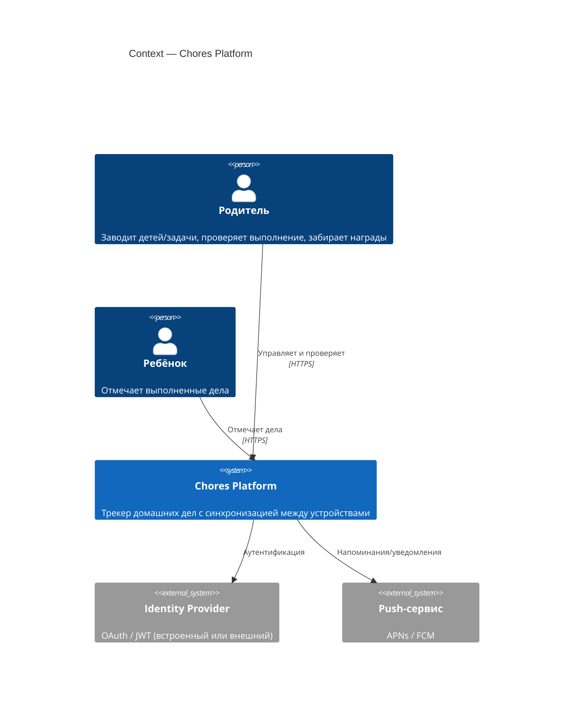
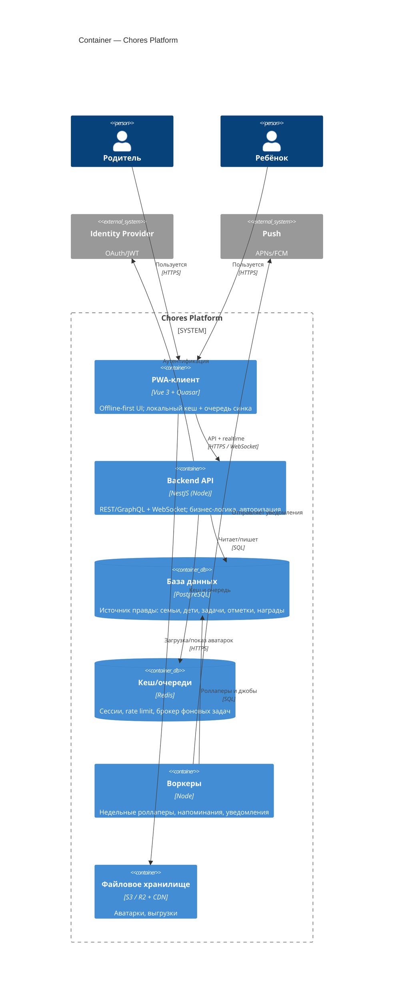

# Фаза 2 — Целевая архитектура (стейт уезжает на бек)

Куда растём, когда одного устройства станет мало. Цель: **источник правды на сервере**,
синхронизация между устройствами (планшет детей + телефон родителя), надёжное хранение
(без риска, что iOS вычистит IndexedDB), несколько семей.

## Зачем бек (драйверы)

- **Мультиустройство/мультипользователь** — родитель отмечает с телефона, дети с планшета, всё сходится.
- **Надёжное хранение** — не зависим от локального кеша браузера; серверные бэкапы.
- **Аутентификация и разграничение** — семьи изолированы, у ребёнка/родителя разные права.
- **Реалтайм** — отметки видны на всех устройствах сразу.
- **Уведомления** — напоминания «сделай дела», «неделя закрывается».

## Ключевые решения (draft)

- **Offline-first остаётся.** PWA продолжает работать оффлайн: локальный кеш + очередь синка; сервер — источник правды.
- **Синк:** очередь мутаций на клиенте, идемпотентные операции, разрешение конфликтов (для отметок достаточно «множество выполненных task×child×date» → merge объединением; для правок — last-write-wins по `updatedAt`).
- **Контракт миграции:** текущий JSON export/import = черновик серверной модели; переносим 1:1, добавляя `familyId`/`userId`.
- **Изоляция слоя данных на клиенте** (уже частично): `completionsRepo` меняет реализацию с IndexedDB на API+кеш, UI не трогаем.

## C4 — Context

## C4 — Container

## Модель данных (серверная, draft)

- `families` — семья/аккаунт (арендатор).
- `users` — родители/опекуны (auth), привязка к семье, роли.
- `children` — дети (имя, аватар, недельная цель), `familyId`.
- `tasks` — каталог задач (имя, иконка, баллы, активность), `familyId`.
- `completions` — отметки: `childId, taskId, date, points(snapshot), createdAt, updatedAt` (+ `familyId`).
- `rewards` — награды (имя, иконка, порог), `familyId`.
- `reward_claims` — выдачи наград (кто/когда забрал).

> Инвариант из MVP сохраняем: `completions.points` — **снимок** стоимости на момент отметки.

## Нефункциональные требования

- **Приватность детей** — изоляция по семье, минимизация PII, приватные аватарки (не публичные URL), удаление данных по запросу.
- **Оффлайн и синк** — работа без сети, сходимость без потерь.
- **Наблюдаемость** — логи/метрики/трейс на API и воркерах.
- **Бэкапы БД** и понятный экспорт (тот же JSON-контракт).

## Порядок внедрения (миграция без переписывания UI)

1. Ввести API + БД, повторить модель из JSON-контракта.
2. Реализовать `completionsRepo` поверх API + локальный кеш (UI без изменений).
3. Добавить auth и семьи (мультиустройство одной семьи).
4. Добавить realtime-синк и разрешение конфликтов.
5. Вынести аватарки в файловое хранилище.
6. Воркеры: роллаперы недели, напоминания, push.
