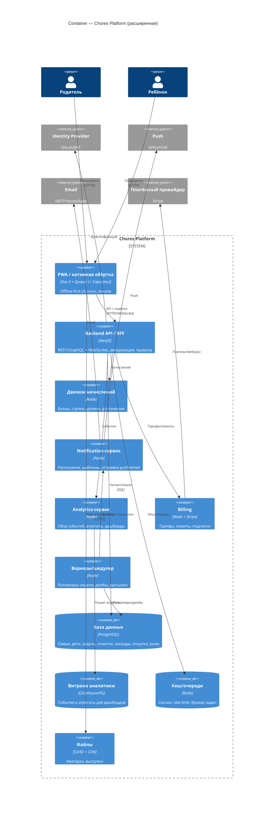

# Фаза 3 — Будущие фичи и расширенная C4

Бэклог фич, которые могут появиться, и как они достраивают целевую архитектуру (фаза 2).
Оцениваем: что фича добавляет к системе (какие контейнеры/данные), приоритет и сложность.

## Бэклог фич

| Фича | Что добавляет | Приоритет | Сложность |
|---|---|---|---|
| **Мультиопекун** (оба родителя, бабушки) | роли/инвайты в семью | Высокий | S |
| **Магазин наград** (копить → тратить баллы) | `reward_catalog`, `purchases`, баланс баллов | Высокий | M |
| **Геймификация** (стрики, уровни, достижения) | правила/движок начислений, `achievements` | Средний | M |
| **Push-напоминания и расписания** | Notification-сервис, шаблоны, расписания | Высокий | M |
| **Аналитика для родителя** (тренды, дашборд) | Analytics-сервис + витрина данных | Средний | M |
| **Локализация** (несколько языков) | i18n на клиенте, локали на сервере | Средний | S |
| **Подписка Pro** (приватность, облако, семьи) | Billing (Stripe), тарифы, лимиты | Средний | M |
| **Нативная обёртка** (Capacitor) для норм. push на iOS | сборка iOS/Android, нативные каналы | Средний | M |
| **Интеграции** (календарь, школа, колонки) | внешние коннекторы | Низкий | L |
| **Роли/возрастные режимы** (ребёнок ≠ админ) | тонкие права в API | Высокий | S |

## Расширенная C4 — Container (после добрасывания фич)

## Как читать таблицу и C4 вместе

- Каждая фича из бэклога = один или несколько **новых контейнеров/таблиц** на расширенной диаграмме.
- Начинаем с высокоприоритетных S/M (мультиопекун, роли, магазин наград, push) — они не тянут тяжёлых внешних систем.
- Тяжёлые (аналитика-витрина, billing, нативная обёртка, интеграции) — отдельными вехами.

## Открытые вопросы (решить перед фазой 2→3)

- Хостинг бэка (managed PG + контейнеры vs serverless).
- Auth: своё решение vs внешний (Clerk/Auth0/Supabase).
- Realtime: свой WebSocket vs готовый (Supabase Realtime / Ably).
- Нужен ли реально нативный клиент (из-за ограничений iOS PWA-push).
