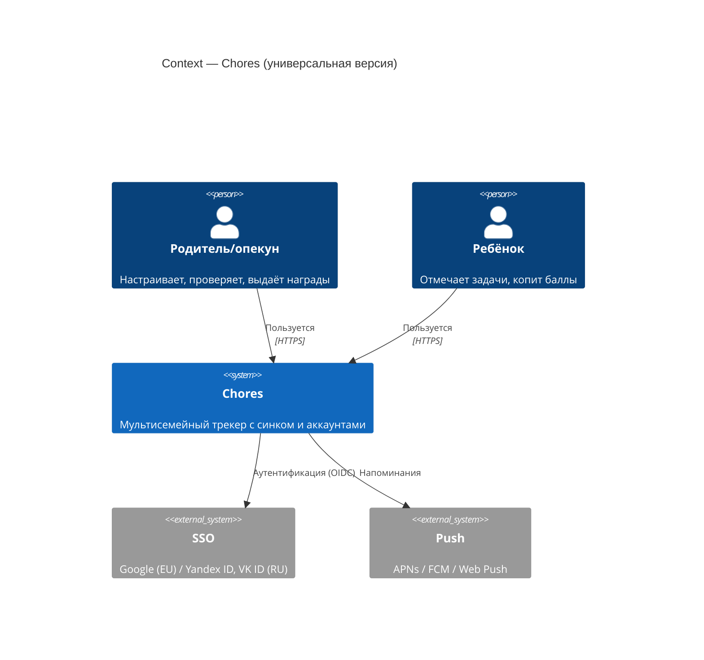
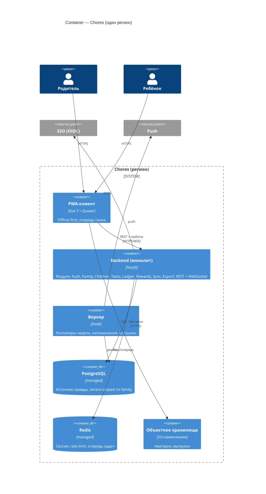
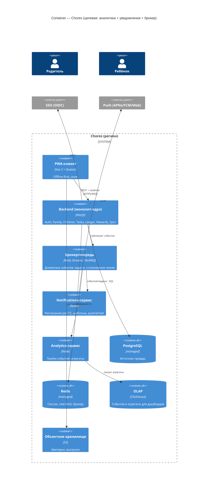

# 02 — Бэкенд, SSO, нагрузка, микросервисы

Цель: сделать приложение **универсальным мультисемейным** — аккаунты, вход через SSO, синхронизация между
устройствами, надёжное хранение. Ниже — честный анализ, что для этого реально нужно.

## Оценка нагрузки (сначала цифры, потом решения)

Семейный трекер дел — это **очень мало трафика**:

- Активность: семья делает единицы записей в день (отметки задач, редкие покупки наград).
- Пусть даже амбициозно **10 000 семей**, ~4 активных членов, 10 записей/день на семью:
  → ~100 000 записей/день ≈ **~1–2 записи/сек в пике**. Чтения тоже единицы/сек.
- Данные крошечные: годовой леджер семьи — сотни-тысячи строк по несколько полей.

**Вывод:** это нагрузка, которую **один небольшой инстанс** держит с колоссальным запасом.
Никакого масштаба, требующего микросервисов/оркестрации, здесь нет и не будет в обозримом будущем.

## Нужны ли микросервисы? — Нет (пока)

Микросервисы решают проблемы, которых у нас нет: независимое масштабирование частей, автономия больших команд,
изоляция отказов тяжёлых подсистем. Ценой — распределённые транзакции, сетевые границы, девопс-накладные.

**Решение: модульный монолит.** Один бэкенд-сервис (NestJS), внутри — чёткие модули с явными границами.
«Сервисы», которые ты накидал (управление детьми, родительский, задачи-кошелёк), проектируем как **модули**, а не
отдельные процессы. Выделять в отдельный сервис — только по реальному сигналу (см. ниже).

### Логические модули (внутри монолита)
- **Identity/Auth** — SSO (OIDC), сессии/JWT, устройства.
- **Family/Tenancy** — семья как арендатор, участники, роли (родитель/ребёнок/опекун), инвайты.
- **Children** — дети, аватары, цели копилки.
- **Tasks** — каталог задач, назначения, правило бонуса.
- **Ledger/Wallet** — completions (+), spends (−), баланс, история (наш нынешний леджер, но на сервере).
- **Rewards** — награды (цена/иконка), покупки/выдача.
- **Sync/Realtime** — очередь мутаций, разрешение конфликтов, WebSocket-пуш изменений.
- **Notifications** — расписания, шаблоны, отправка push/email (естественный кандидат на воркер).
- **Export/Backup** — выгрузка/импорт (тот же JSON-контракт, что и сейчас).

### Когда реально дробить на сервисы
Сигналы, при которых стоит выделить отдельный процесс:
- **Уведомления/рассылки** дают тяжёлый асинхрон и всплески → вынести воркер + очередь (первый кандидат).
- **Аналитика** с отдельным хранилищем (события, агрегаты) → отдельный сервис + витрина.
- Резкий рост и потребность масштабировать конкретный домен независимо.
Начинаем с монолита + один фоновой воркер (роллаперы недели, напоминания) в том же образе или отдельным процессом.

## SSO (вход)

- **Стандарт:** Google **OIDC** (Authorization Code + PKCE). Рабочий вариант «в лоб».
- **Проще:** взять **managed-auth** и не поддерживать своё: Supabase Auth / Clerk / Auth0 / Firebase Auth.
  Для маленького проекта это экономит недели (соц-логины, сессии, восстановление, MFA из коробки).
- **Региональный нюанс (важно):** в **RU-сегменте Google-вход может быть недоступен/нестабилен**.
  → В RU основным делаем **Yandex ID / VK ID**, Google — опционально. В EU — Google (и/или email-magic-link).
- Модель ролей: ребёнок логинится редко или вообще пользуется «семейным» устройством; чувствительные действия
  (правка истории, награды, настройки) — под родителем. Родрежим-пароль из MVP превращается в роль в аккаунте.

## Offline-first и синхронизация (сохраняем принцип MVP)

PWA продолжает работать оффлайн; сервер — источник правды.
- Клиент копит **очередь мутаций**, операции **идемпотентны** (у нас уже uuid у записей).
- Разрешение конфликтов: для отметок/списаний — **объединение множеств** (одна запись = task×child×date / uuid),
  для правок настроек — **last-write-wins по updatedAt**.
- Контракт миграции = текущий **JSON export/import**; серверная модель повторяет его, добавляя `familyId`/`userId`.

## C4 — Context

## C4 — Container (модульный монолит)

## Плановые выделенные сервисы (закладываем слоты сейчас)

Часть доменов заранее проектируем под вынос в отдельные сервисы — не потому что нужно на старте, а чтобы границы и
события были готовы к моменту, когда это понадобится. Стартуем модулями в монолите, публикуем доменные события в брокер,
и по сигналу выносим consumer'ы в отдельные процессы **без переписывания**.

- **Notifications-сервис.** Расписания напоминаний (per-timezone), шаблоны, отправка push/email/Web Push.
  Первый кандидат на вынос: тяжёлый асинхрон + всплески.
- **Analytics-сервис + OLAP.** Приём продуктовых/поведенческих событий (отметки, покупки, стрики) → агрегаты и дашборды
  (для родителя и для продукта). Хранилище — **OLAP (ClickHouse)**: колоночное, дёшево на рядах событий и агрегатах.
  На старте события можно складывать в Postgres и переехать в ClickHouse при росте объёма.

## Нужен ли брокер сообщений (Kafka)?

**Kafka — нет** (overkill). Он про durable high-throughput streaming и много consumer-групп; операционно тяжёлый, а наши
объёмы (см. оценку нагрузки) крошечные.

Но **лёгкий брокер/очередь — да, закладываем**, по двум причинам:
1. **Асинхрон и развязка:** уведомления и аналитика потребляют события независимо от API (API быстро отвечает, работа уходит в очередь).
2. **Сглаживание всплесков:** аудитория в РФ в разных часовых поясах → нагрузка **постоянная, но неравномерная**
   (крон «сделай дела в 18:00 локально» бьёт волнами по TZ; редкий скачок регистраций). Очередь гасит пики, consumer'ы разгребают в своём темпе.

**Чем закрываем (по возрастанию тяжести):**
- **Redis Streams / BullMQ** — Redis у нас уже есть; надёжные очереди задач + pub/sub с consumer-группами. **Рекомендация для старта.**
- **Managed-очередь** (Cloud Pub/Sub, SQS/SNS, NATS) — если хочется managed без своей эксплуатации.
- **Kafka / Redpanda** — только если реально появится durable high-volume streaming для аналитики. Для этого приложения — вряд ли когда-либо.

**Защита от скачка пользователей** — это не Kafka, а: stateless API + горизонтальный автоскейл, очередь на асинхрон,
rate-limit, managed-БД с запасом. Брокер тут про развязку и ровную обработку, а не про «выдержать RPS».

## C4 — Container (целевая, с доп. сервисами)

## Данные (серверные, tenant-scoped)
`families` · `users` · `memberships(userId, familyId, role)` · `children` · `tasks` · `completions` · `spends` ·
`rewards` · `devices` · `invites`. Всё, кроме `users`, скоупится по `familyId`. Инвариант из MVP сохраняем:
**стоимость/баллы — снимок на момент записи** (история не переписывается при смене цен).

## Стек (рекомендация)
- **API:** NestJS (TypeScript) — модульность из коробки, совпадает с фронтовым TS.
- **БД:** PostgreSQL (managed). **Кеш/очередь:** Redis (managed). **Файлы:** S3-совместимое.
- **Auth:** managed (Supabase/Clerk/Auth0) либо своё OIDC; провайдеры зависят от региона.
- **Реалтайм:** свой WebSocket (Nest gateway) или готовый (Supabase Realtime / Ably) — на нашем масштабе хватит своего.
- **Контейнеризация:** один образ API (+ опц. воркер). Оркестрация — не нужна; хватит managed-контейнеров (см. `03`).
