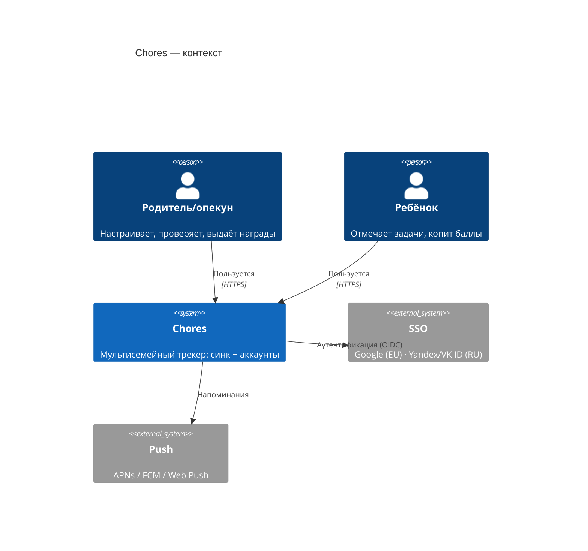

# 02 — Бэкенд: нагрузка, монолит, SSO, синк

Цель: сделать приложение **универсальным мультисемейным** — аккаунты, вход через SSO,
синхронизация между устройствами, надёжное хранение. Ниже — принятые решения, не варианты.

## Зачем бэкенд (драйверы)

- **Мультиустройство/мультипользователь** — родитель с телефона, дети с планшета, всё сходится.
- **Надёжное хранение** — не зависим от локального кеша браузера (iOS чистит IndexedDB), серверные бэкапы.
- **Аутентификация и изоляция** — семьи разделены, у ребёнка и родителя разные права.
- **Уведомления** — напоминания «сделай дела», «неделя закрывается».

## Оценка нагрузки (сначала цифры, потом решения)

Семейный трекер дел — это **очень мало трафика**:

- Активность: семья делает единицы записей в день (отметки задач, редкие покупки наград).
- Пусть даже амбициозно **10 000 семей**, ~4 активных членов, 10 записей/день на семью:
  → ~100 000 записей/день ≈ **~1–2 записи/сек в пике**. Чтения тоже единицы/сек.
- Данные крошечные: годовой леджер семьи — сотни-тысячи строк по несколько полей.

**Вывод:** это нагрузка, которую **один небольшой инстанс** держит с колоссальным запасом.
Масштаба, требующего оркестрации и дробления на множество сервисов, здесь нет и не будет в обозримом будущем.

## Форма развёртывания: модульный монолит + выделенные async-сервисы

**Решение:** ядро бизнес-доменов — **один модульный монолит на NestJS** (чёткие модули с явными границами).
Отдельными процессами выносим только асинхронную и пиковую работу: **Notifications — с первого дня**,
**Analytics — по триггеру** (см. ниже). Микросервисов по доменам не делаем: распределённые транзакции и сетевые
границы на нашем масштабе — чистые накладные расходы.

### Модули монолита-ядра
- **Identity/Auth** — свой OIDC (провайдеры по региону), сессии/JWT, устройства.
- **Family/Tenancy** — семья как арендатор, участники, роли (родитель/ребёнок/опекун), инвайты.
- **Children** — дети, аватары, цели копилки.
- **Tasks** — каталог задач, назначения, правило бонуса.
- **Ledger/Wallet** — `completions` (+), `spends` (−) с полем `source`, баланс, история (наш леджер, но на сервере).
- **Rewards** — награды (цена/иконка/видимость), покупки и выдача за серию.
- **Sync** — очередь мутаций, идемпотентность, разрешение конфликтов.
- **Export/Backup** — выгрузка/импорт (тот же JSON-контракт, что и сейчас).

### Выделенные сервисы
- **Notifications — отдельный процесс с первого дня.** Расписания напоминаний per-timezone, шаблоны,
  отправка push/email/Web Push. Причина ранней изоляции: тяжёлый асинхрон + всплески по часовым поясам.
- **Analytics + OLAP — зарезервированы в схеме, поднимаются по триггеру.** Контейнеры Analytics и ClickHouse
  присутствуют в целевой C4 сразу, но **события на старте пишем в Postgres**; отдельный сервис и переезд на
  ClickHouse — когда вырастет объём событий или понадобятся дашборды. Дальнейшее дробление — только по такому же
  явному сигналу (независимое масштабирование конкретного домена).

## SSO (вход)

**Решение: свой тонкий OIDC-слой** (NestJS + passport), свои сессии/JWT и учёт устройств. Готовый managed-auth
(Supabase/Clerk/Auth0) не берём: ни один не покрывает оба региона, а регионы всё равно развёрнуты изолированно.

- **Провайдеры по региону:** EU — Google (Authorization Code + PKCE); RU — **Yandex ID / VK ID**
  (Google в РФ недоступен/нестабилен).
- **Роли:** ребёнок логинится редко или пользуется «семейным» устройством; чувствительные действия (правка истории,
  награды, настройки) — под родителем. Родрежим-пароль из MVP превращается в роль в аккаунте.

## Offline-first и синхронизация (сохраняем принцип MVP)

PWA продолжает работать оффлайн; сервер — источник правды.
- Клиент копит **очередь мутаций**, операции **идемпотентны** (у нас уже uuid у записей).
- Разрешение конфликтов: для отметок/списаний — **объединение множеств** (одна запись = task×child×date / uuid),
  для правок настроек — **last-write-wins по `updatedAt`**.
- Контракт миграции = текущий **JSON export/import**; серверная модель повторяет его, добавляя `familyId`/`userId`.
- **Realtime на старте не делаем.** Изменения других устройств подтягиваются при refetch (открытие/фокус), не мгновенно.
  WebSocket-пуш — поздний шаг; когда понадобится, это свой Nest-gateway, отдельный сервис под realtime не заводим.

## C4 — Context



## C4 — Container (целевая, один регион)

Ядро — монолит + Notifications; Analytics и OLAP зарезервированы (события до триггера идут в Postgres).

```mermaid
C4Container
  title Chores — контейнеры (регион; Analytics/OLAP — зарезервированы)
  Person(parent, "Родитель")
  Person(child, "Ребёнок")
  Container(spa, "PWA-клиент", "Vue 3 + Quasar", "Offline-first + очередь синка; обновление по refetch")
  System_Boundary(sys, "Chores (регион)") {
    Container(api, "Backend монолит-ядро", "NestJS", "Auth(OIDC) · Family · Children · Tasks · Ledger · Rewards · Sync · Export")
    Container(notify, "Notifications", "Node", "Расписания per-TZ, push/email")
    Container(broker, "Брокер/очередь", "Redis Streams / BullMQ", "События, отложенные задачи, сглаживание пиков")
    ContainerDb(db, "PostgreSQL", "managed", "Источник правды + события аналитики до триггера")
    ContainerDb(cache, "Redis", "managed", "Сессии, rate-limit")
    Container(analytics, "Analytics (по триггеру)", "Node", "Приём событий, агрегаты")
    ContainerDb(olap, "OLAP (по триггеру)", "ClickHouse", "События, агрегаты при росте объёма")
    Container(storage, "Объектное хранилище", "S3", "Аватарки, выгрузки")
  }
  System_Ext(idp, "SSO региона", "Google · Yandex/VK")
  System_Ext(push, "Push", "APNs / FCM / Web Push")
  Rel(parent, spa, "HTTPS")
  Rel(child, spa, "HTTPS")
  Rel(spa, api, "REST")
  Rel(spa, storage, "Аватарки")
  Rel(api, db, "SQL")
  Rel(api, cache, "Сессии/rate-limit")
  Rel(api, idp, "OIDC")
  Rel(api, broker, "Публикует события")
  Rel(broker, notify, "События/задачи")
  Rel(broker, analytics, "События")
  Rel(analytics, olap, "Агрегаты")
  Rel(notify, push, "Push")
  UpdateLayoutConfig($c4ShapeInRow="3", $c4BoundaryInRow="1")
```

## Брокер/очередь сообщений

Брокер/очередь — **Redis** (Streams для событий, BullMQ для отложенных задач). Redis уже используется под сессии, кеш и rate-limit. Kafka не берём — избыточна для нашего объёма.

Роль брокера:
1. **Асинхрон и развязка:** Notifications и Analytics потребляют события независимо от API — API быстро отвечает, работа уходит в очередь.
2. **Сглаживание всплесков:** аудитория в разных часовых поясах → нагрузка неравномерная (крон «сделай дела в 18:00 локально» бьёт волнами по TZ). Очередь гасит пики, consumer'ы разгребают в своём темпе.

Защита от скачка пользователей: stateless API + горизонтальный автоскейл, rate-limit, managed-БД с запасом.

## Данные (серверные, tenant-scoped)
`families` · `users` · `memberships(userId, familyId, role)` · `children` · `tasks` · `completions` ·
`spends(..., source: 'purchase' | 'streak')` · `rewards` · `devices` · `invites`.
Всё, кроме `users`, скоупится по `familyId`. Выдачу награды за серию пишем в `spends` с `source: 'streak'`
(отдельной таблицы `reward_claims` не заводим). Инвариант из MVP сохраняем: **стоимость/баллы — снимок на момент
записи** (история не переписывается при смене цен).

## Стек
- **API:** NestJS (TypeScript) — модульность из коробки, совпадает с фронтовым TS.
- **БД:** PostgreSQL (managed). **Кеш/очередь:** Redis (managed). **Файлы:** S3-совместимое.
- **Auth:** свой OIDC (NestJS + passport), провайдеры по региону (Google · Yandex/VK).
- **Realtime:** на старте нет; при необходимости — свой WebSocket (Nest gateway).
- **Контейнеризация:** два образа с первого дня — **API** и **Notifications**; Analytics/OLAP добавляются образами
  по триггеру. Оркестрация не нужна — хватит managed-контейнеров (см. `03`).
