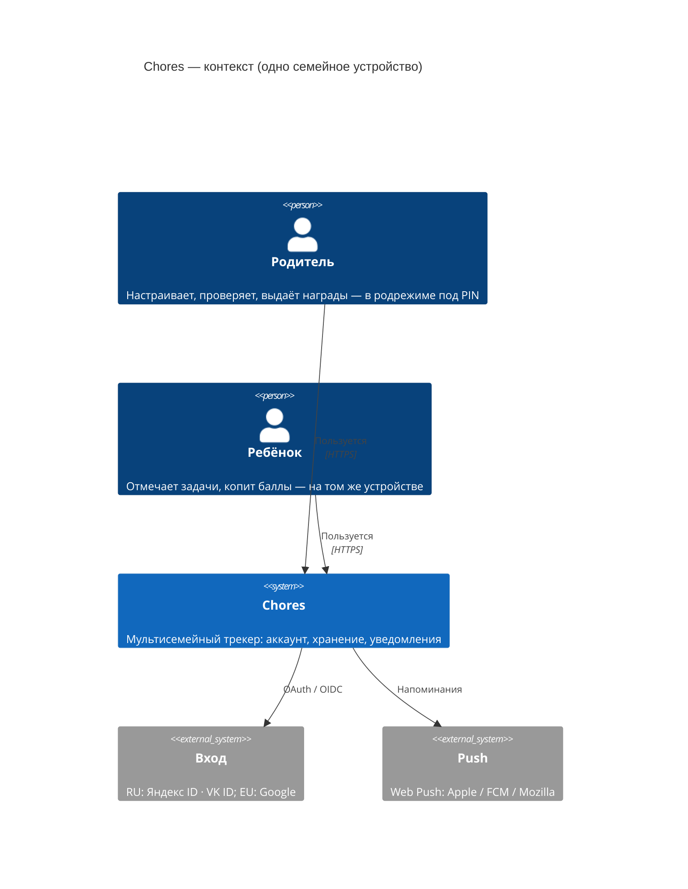

# 02 — Бэкенд: нагрузка, модульный монолит, события, вход, синк

Ресерч перед ADR. По каждому пункту: контекст и ограничения → варианты → решение → риски. Факты,
которые проверялись, помечены ссылкой в разделе «Источники»; оценки и мнения помечены как оценки.

**Статус:** ресерч, версия 2 (сентябрь 2026). Решения здесь — предложения для ADR, не финал.

## 1. Зачем бэкенд (драйверы)

1. **Не потерять данные.** Вся история семьи живёт в IndexedDB одного устройства. Её теряют при
   потере, смене или сбросе устройства, удалении иконки или данных сайта, вытеснении при нехватке
   места. Серверная копия и восстановление по входу в аккаунт закрывают эти случаи. Ограничение
   ITP «7 дней без визитов» к установленной PWA не относится — у неё свой счётчик [webkit-10218].
2. **Аккаунты и мультисемейность.** Сейчас приложение — «одна семья на устройство». Чтобы им
   пользовались другие семьи, нужны аккаунт, изоляция данных семей и восстановление по входу.
3. **Уведомления.** «Сделай дела», «неделя закрывается» — нужен сервер с расписанием по часовому
   поясу семьи.
4. **Обучение и задел на рост.** Проект — ещё и полигон: событийная архитектура, очереди,
   региональные развёртывания. Часть компонентов закладываем раньше, чем их требует нагрузка
   (см. раздел 5) — это осознанное решение, а не оценка нагрузки.

## 2. Оценка нагрузки

- Семья делает единицы записей в день: отметки задач, редкие покупки наград.
- Амбициозно **10 000 семей**, 10 записей в день на семью → ~100 000 записей/день ≈
  **1–2 записи/с в пике**. Чтения — единицы в секунду (открытие приложения, refetch при фокусе).
- Данные крошечные: годовой леджер семьи — сотни-тысячи строк. Фото — отдельно, см. `04`.
- Всплески — по часовым поясам: крон «напомнить в 18:00 по времени семьи» бьёт волнами.

**Вывод:** один небольшой инстанс API и одна managed-БД держат это с запасом в сотни раз.
Горизонтальное масштабирование по нагрузке не нужно. Всё, что сверх этого, — задел и обучение.

## 3. Форма развёртывания: модульный монолит + выделенные сервисы

**Почему комбинированная схема.** Под нашу задачу и размер приложения отдельные сервисы и
контейнеры под каждую сущность (дети, задачи, награды, леджер) не нужны. Эти домены маленькие,
тесно связаны (отметка задачи → баллы → серия → приз) и меняются вместе — разнесённые по сервисам,
они дали бы распределённые транзакции, сетевые границы и N деплоев без выгоды. Поэтому доменное
ядро — один модульный монолит. А то, что действительно отделяется — другой характер нагрузки,
собственный жизненный цикл, общение только через события, — **выделяем в отдельный сервис сразу**.
Первый такой сервис — Notifications.

**Варианты:**

| Вариант | Плюсы | Минусы |
|---|---|---|
| Микросервисы по доменам | Независимый деплой каждого домена | Домены связаны, транзакции распределённые, N деплоев — накладные расходы без выгоды на нашем масштабе |
| Один монолит на всё | Проще всего | Рассылки и расписания делят процесс с API; границу Notifications потом выделять дороже |
| **Модульный монолит + выделенные сервисы** | Ядро без распределённых транзакций; то, что живёт своей жизнью, изолировано с первого дня | Нужна дисциплина границ модулей в ядре (как FSD на фронте) и контракт событий |

**Решение:**

| Сервис | Что внутри | Когда |
|---|---|---|
| **`api`** — модульный монолит | Все доменные модули (таблица ниже), HTTP API, запись событий в `outbox`, `outbox-relay` отдельной командой из того же образа | С первого дня |
| **`notifications`** — отдельный сервис | Подписки Web Push, расписания напоминаний по часовому поясу семьи, шаблоны, отправка push, лента уведомлений | **С первого дня** |
| `analytics` — отдельный сервис | Приём событий, агрегаты, ClickHouse | По триггеру: дашборды или рост объёма событий. До этого события лежат в `outbox` |

**Почему Notifications — отдельно с первого дня:**

- Другой характер нагрузки: волны по часовым поясам («сделай дела в 18:00 по времени семьи»),
  ретраи внешних push-сервисов — не должны тормозить API.
- Не участвует в доменных транзакциях: всё, что ему нужно, приходит событиями (`task.completed`,
  `week.closing`, `family.timezone.changed`).
- Свой жизненный цикл и внешние зависимости (VAPID, Web Push-эндпоинты).
- Отработка событийной архитектуры с настоящим отдельным потребителем (см. раздел 5).

**Границы `notifications`:** свой контейнер и свой образ; своя схема в той же Postgres
(`notifications.*`: подписки, расписания, журнал отправок) — таблицы ядра не читает; с ядром
общается только событиями — consumer group в Redis Streams и очереди BullMQ. Код — в том же монорепозитории,
общий пакет `contracts` со схемами событий.

**Когда выделять следующий сервис** — только по такому же явному признаку: свой характер нагрузки,
общение только событиями, независимое масштабирование. Размер модуля или «так чище» — не признак.

### Модули монолита

| Модуль | Что внутри |
|---|---|
| **Identity** | Пользователи, внешние аккаунты (Яндекс, VK, Google) — только хеш идентификатора, сессии, устройства |
| **Family** | Семья как арендатор, часовой пояс, членство. Роль пока одна — родитель |
| **Children** | Дети, фото (ссылка на хранилище, см. `04`), цели |
| **Tasks** | Каталог задач, периоды активности, правило бонуса |
| **Rewards** | Награды, видимость, варианты (см. бэклог «Награда с выбором») |
| **Ledger** | `completions` (+), `spends` (−) со снимками цены, баланс и серии — вычисляются |
| **Settings** | Бонус, вехи серии, прочие правила семьи |
| **Sync** | Приём изменений из очереди устройства, защита от повторов, выдача новых изменений (раздел 7) |
| **Backup** | Экспорт/импорт — тот же JSON-контракт, что сейчас в `features/backup` |
| **Meta** | Версия сервера, `minClientVersion`, ченджлог — `GET /v1/meta` (раздел 9) |

Модули общаются через публичный интерфейс модуля (как `index.ts` слайса на фронте) и через события.
Прямой доступ к таблицам чужого модуля запрещён.

## 4. Процессы и события: как всё связано

```
клиент ──REST──▶ api ──(одна транзакция)──▶ Postgres: данные + outbox
                                               │
                                        outbox-relay
                                               ▼
                                   Redis Streams (events)
                                    │                 │
                        group: notifications   group: analytics (позже)
                                    ▼
                          notifications ──▶ Web Push, лента
```

## 5. Брокер и очереди: Redis с первого дня

**Честная оценка нагрузки:** на старте Redis **не обязателен**. Postgres закрывает всё сам:
очереди через `SKIP LOCKED` (pg-boss, Graphile Worker), события через transactional outbox и
LISTEN/NOTIFY, сессии в таблице, rate-limit в памяти процесса [pgboss-cmp]. Нам нужно на 2–3
порядка меньше, чем эти инструменты держат.

**Решение: всё равно закладываем Redis с первого дня** — ради масштабирования и чтобы отработать
событийную архитектуру с потребителями на реальном проекте. Kafka — перебор: отдельный кластер,
ZooKeeper/KRaft, операционная сложность без выгоды на нашем объёме.

**Как используем:**

| Задача | Механизм |
|---|---|
| Доменные события | **Redis Streams** + consumer groups: у каждого потребителя своя группа, свой темп, `XACK`, переобработка зависших через `XAUTOCLAIM`, dead-letter поток после N попыток |
| Отложенные и повторяющиеся задачи | **BullMQ**: напоминания по часовому поясу семьи, ретраи отправки push |
| Сессии | Ключ `session:{id}` с TTL, индекс сессий пользователя — для «выйти на всех устройствах» |
| Rate-limit | `@nestjs/throttler` с Redis-хранилищем — работает при нескольких инстансах API |

**Надёжность событий — transactional outbox.** Запись в Redis нельзя сделать атомарной с записью в
Postgres: событие может потеряться (упали после коммита) или появиться без данных (упали до).
Поэтому:

1. `api` в той же транзакции, что и бизнес-запись, пишет событие в таблицу `outbox`.
2. `outbox-relay` читает неотправленные строки, делает `XADD` в Stream, помечает отправленными.
3. Доставка — «хотя бы один раз»: при сбое между `XADD` и пометкой событие уйдёт повторно.
   Потребители идемпотентны — хранят обработанные `eventId`.

Outbox заодно — журнал событий для Analytics до появления ClickHouse.

**Какой Redis: Redis или Valkey — по тому, что даёт облако региона.** Оба подходят:

- **Лицензия нам не мешает.** С Redis 7.4 (март 2024) лицензия RSALv2/SSPLv1, Redis 8 (май 2025)
  добавил AGPLv3 [redis-agpl]. RSAL/SSPL запрещают продавать сам Redis как managed-сервис, AGPL
  требует открыть исходники, если модифицировал Redis и отдаёшь его по сети. Мы подключаемся к нему
  как клиент — ни то, ни другое нас не касается.
- **Возможности для нас одинаковые.** Streams, consumer groups, TTL, Lua и BullMQ работают в обоих.
  Фичи только Redis 8 (JSON, поиск, vector sets) нам не нужны.
- **Решает managed-предложение.** Valkey — форк 7.2.4 под BSD-3 в Linux Foundation. Managed Valkey:
  Yandex Cloud, OVHcloud, Aiven; managed Redis: VK Cloud, Selectel, Scaleway, Upstash, Redis Cloud
  [yc-valkey, ovh-valkey, vk-dbaas]. Выбор по региону — в `03`. Есть выбор — берём Redis.

Дальше в документе «Redis» означает Redis-совместимое хранилище, код пишем под общую базу.

**Переход Redis ↔ Valkey** — дешёвый, если держать три правила:

1. **Только общая база команд Redis 7.2.** Valkey — форк 7.2.4, протокол RESP тот же, клиенты
   (`ioredis`, `node-redis`) и BullMQ работают с обоими. Дальше ветки расходятся: у Redis 8 в ядре
   JSON, поиск, vector sets; у Valkey 8/9 — свои расширения. Streams, TTL, Lua-скрипты BullMQ —
   в общей базе. Не используем модули и команды, которые есть только в одной ветке.
2. **В Redis нет ничего невосстановимого.** Источник правды — Postgres: события лежат в `outbox`,
   напоминания пересоздаются из расписаний семьи, сессии в худшем случае — повторный вход.
3. **Переезд — это смена адреса подключения, а не миграция данных.** Дамп RDB между ветками
   переносить не пытаемся: форматы после 7.2 разошлись (не проверено по версиям). Порядок:
   остановить `notifications` и `outbox-relay`, дочитать потоки, переключить URL, пересоздать отложенные задачи из
   Postgres, запустить.

При таких правилах переезд — час работы и короткое окно обслуживания.

**Риски:** ещё один stateful-компонент на каждый регион (мониторинг, память, персистентность AOF
для Streams). Запасной вариант, если Redis станет обузой: pg-boss поверх Postgres — outbox уже есть,
меняется только транспорт.

## 6. Вход и сессии

### 6.1. Контуры и провайдеры

RU и EU — два отдельных сайта (`03`): RU — на российских серверах и российском домене, EU — на
европейских. У каждого свой вход, стандартный для его аудитории, без общих аккаунтов:

| Контур | Провайдер | Протокол | Особенности |
|---|---|---|---|
| **RU** | **Яндекс ID** | OAuth 2.0 Authorization Code + PKCE (S256) | Не OIDC: нет discovery и `id_token`, профиль — `login.yandex.ru/info` [yandex-id] |
| RU, опционально | VK ID | OAuth 2.1, PKCE обязателен | `device_id` из колбэка при обмене кода, userinfo только POST [vkid] |
| **EU** | **Google** | OIDC, Authorization Code + PKCE | Стандартный; минимальный scope — `openid email` |

- RU-контур с входом через Яндекс ID закрывает ч. 10 ст. 8 149-ФЗ: Яндекс ID — информационная
  система российского владельца [cons-406]. Штрафы за нарушение — ст. 13.55 КоАП с 07.07.2026
  [cons-199].
- EU-контур — иностранный сайт со своим входом, ограничения RU-контура на него не переносим.
- Своих паролей, email-кодов и SMS нет: вход — только через провайдера. Это и проще, и не
  требует хранить контакты (раздел 6.2).
- Sberbank ID, T-ID, Apple — не берём на старте: нужна организация и договоры (Сбер, T-ID), для
  PWA не обязателен и глючит в standalone-режиме (Apple).

### 6.2. Минимум персональных данных при входе

Цель — чтобы сервер знал о родителе как можно меньше. Аккаунт нужен только для одного: узнать ту
же семью на новом устройстве.

- **Запрашиваем минимальный scope.** Google требует `openid` вместе с `email` или `profile` —
  берём `openid email`, email из ответа не сохраняем, берём только `sub` [google-oidc]. Яндекс — без
  прав `login:*`: `login.yandex.ru/info` всё равно отдаёт `id`, `login` и `psuid`; `login` сразу
  отбрасываем, ключом берём `psuid` (привязан к приложению — не проверено) или `id` [yandex-info].
- **Храним не идентификатор, а его хеш.** В `auth_accounts` — `provider` + `HMAC(sub, pepper)`,
  где `pepper` — секрет контура. Для входа этого достаточно (сравниваем хеши), а сам
  идентификатор провайдера в базе и бэкапах не лежит.
- **Не храним:** email, имя, телефон, аватар родителя, токены провайдера (после входа не нужны —
  к API провайдера мы больше не ходим).
- **Не логируем IP и User-Agent** в постоянные логи. Rate-limit по IP — только в Redis с коротким
  TTL.
- **Следствие:** нет канала «написать родителю». Восстановление доступа — только через
  провайдера; уведомления — push и лента в приложении (раздел 11). Email, если понадобится, —
  отдельным согласием и отдельной фичей.

Полностью уйти от ПДн не получится: хеш идентификатора для РКН — тоже ПДн (оператор может
сопоставить), так что оператором в RU-контуре мы остаёмся в любом случае. Минимизация уменьшает
объём и последствия утечки, а не снимает обязанности (`04`).

Что после этого остаётся персональными данными — имена и фото детей, которые вводит родитель, —
разбирается в `04`. Там же — можно ли структурировать хранение так, чтобы сервер вообще не видел
ПДн в открытом виде.

### 6.3. Своё или готовое

| Вариант | Плюсы | Минусы |
|---|---|---|
| Облачный сервис входа (Auth0, Clerk, Supabase Auth) | Ничего не пишем | Нет в обоих регионах, хранит профиль пользователя у себя |
| Свой сервер входа в каждом контуре (Keycloak, Zitadel, Authentik, Ory, Logto) | Готовые сессии, MFA, админка | Ещё один сервис с базой в каждом контуре, хранит профиль пользователя |
| Библиотека Better Auth | Готовые сессии, провайдер VK есть | Рассчитана на пользователя с email; с NestJS — через сторонний пакет [ba-nest] |
| **Свой модуль входа** | Храним ровно то, что решили в 6.2 | Сессии и защиту от перебора пишем сами |

**Решение: свой модуль входа (Identity) внутри `api`.**

- Обмен кода на токен у Google — библиотека `openid-client`. У Яндекса и VK протокол нестандартный
  (раздел 6.1), для них пишем по небольшому адаптеру.
- Сами пишем: таблицу `auth_accounts` с хешем идентификатора, сессии в Redis, ограничение
  попыток входа.
- Кода немного: нет паролей, email и одноразовых кодов — только «вернулся от провайдера → нашли
  или создали аккаунт → выдали сессию».

### 6.4. Сессии

**Решение:** серверная сессия + cookie `httpOnly; Secure; SameSite=Lax`. API на том же сайте, что
и фронт (`app.<домен>` + `api.<домен>` или `/api`). JWT в localStorage не используем.

- httpOnly-cookie не читается скриптом — XSS не уносит сессию.
- Cookie, выставленные сервером, не попадают под 7-дневный лимит ITP (он для cookie из JS); у PWA
  на экране «Домой» свой счётчик [webkit-10218]. Кросс-сайтовые cookie Safari блокирует — отсюда
  требование «тот же сайт».
- Серверную сессию можно отозвать (выход, потеря устройства) без чёрного списка токенов.
- Сессия живёт долго (семейный планшет не должен разлогиниваться), со скользящим продлением.
- CSRF: `SameSite=Lax` + проверка `Origin` на изменяющих запросах.
- В сессии — только `userId`, `familyId`, `deviceId`, время создания.

**Подвох iOS:** у PWA на экране «Домой» и у Safari **раздельные cookie**. OAuth-редирект может
открыться в Safari, и сессия окажется не в PWA [netguru-pwa]. Решение — передача входа кодом:
если вход завершился в Safari, сервер показывает короткий одноразовый код (живёт минуту), родитель
вводит его в PWA, и PWA получает свою сессию. Сначала проверить на реальном iPad — возможно,
редирект в том же окне остаётся в PWA и код не понадобится.

### 6.5. Родрежим и PIN

Родрежим на общем устройстве остаётся: аккаунт родителя залогинен на семейном планшете, PIN
отделяет «родительские» экраны от ребёнка. Сервер доверяет сессии, PIN — локальный замок.

- Сейчас PIN хранится в `settings` открытым текстом — перед синком хранить хеш (PBKDF2/argon2 с
  солью), иначе он уедет на сервер и в бэкапы.
- Шесть цифр — 10⁶ вариантов: нужен лимит попыток с нарастающей задержкой.
- Сброс PIN — через повторный вход в аккаунт.

## 7. Работа без сети и синхронизация

### 7.1. Как это работает

- Приложение, как и сейчас, пишет всё в локальную базу на устройстве (IndexedDB) и работает без
  сети.
- Каждое изменение (отметка задачи, покупка, правка награды) дополнительно кладётся в **очередь
  на отправку** — отдельную таблицу в той же локальной базе.
- Когда есть сеть, очередь отправляется на сервер. Нет сети — приложение работает как обычно,
  очередь ждёт.
- **Главная копия данных — на сервере.** Локальная база — рабочая копия на устройстве.

### 7.2. Этапы

**Этап 1 — одно устройство (сейчас).** Конфликтов нет: пишет только одно устройство. Задача — не
потерять данные.

- Первый вход в аккаунт — приложение отправляет на сервер всю локальную базу (в формате
  существующего экспорта JSON).
- Дальше каждое изменение уходит на сервер через очередь.
- Новое или сброшенное устройство — вход в аккаунт, и приложение скачивает всё с сервера.

**Этап 2 — несколько устройств (потом, см. «Планы на будущее»).** Приложение ещё и забирает с
сервера изменения, сделанные на других устройствах, — при открытии и при возврате в приложение.
Мгновенного обновления нет.

### 7.3. Переезд с текущей версии

Локальная база и установленная PWA привязаны к адресу сайта (`siritoskon.github.io`). На новом
домене база будет пустой — данные сами не переедут.

**Для нас это не проблема:** сейчас приложением пользуется одна семья, все данные — на одном
устройстве. Переносим вручную: экспорт JSON на старом адресе → вход на новом → импорт. Отдельный
механизм переноса не делаем. На старом адресе оставляем страницу «Приложение переехало» со
ссылкой.

### 7.4. Правила, которые закладываем сразу

Этап 1 можно сделать проще, но тогда этап 2 потребует переделки. Поэтому правила — сразу:

| Правило | Зачем |
|---|---|
| У каждого изменения свой id | Если связь оборвалась и изменение отправилось дважды, сервер узнает повтор и не создаст дубль |
| Сервер нумерует принятые изменения по порядку | Устройство просит «всё после номера N» и получает только новое. Часам устройства не доверяем — на детском планшете они могут уходить |
| Ничего не удаляем, а помечаем удалённым | Иначе другое устройство не узнает, что строка удалена. Для задач и наград это уже так (`archivedAt`), для отметок и покупок добавим `deletedAt` |
| Одна отметка на ребёнка, задачу и день; её id вычисляется из этих трёх значений | Два устройства без сети отметят одно и то же — на сервере будет одна строка, а не две |
| Два устройства изменили одно и то же: отметки и покупки сохраняем все, в настройках и каталоге побеждает последнее принятое сервером | Отметки и покупки — отдельные события, их не надо выбирать. Настройка одна — выбираем последнюю |
| День отметки — по часовому поясу семьи | Отметка «за вторник» не должна уехать в среду из-за UTC |
| Баланс и серии не храним, а считаем из истории | Как и сейчас. Хранимые копии на разных устройствах разъедутся. Показанные поздравления — только на устройстве |
| Сервер может отклонить изменение | Например, покупку, если баланса уже не хватает. Приложение показывает, что именно не прошло |

### 7.5. Почему своя очередь, а не готовая библиотека

Готовые движки синхронизации решают задачу «много пользователей правят одно в реальном времени» —
её у нас нет. А взамен требуют заменить Dexie или держать ещё один сервис.

| Вариант | Почему нет |
|---|---|
| Dexie Cloud | Свой сервер синхронизации: облако или установка у себя от €3 495 [dexie-cloud] |
| RxDB | Пришлось бы уйти с Dexie; часть плагинов платная |
| PowerSync | SQLite вместо Dexie и отдельный сервис. Запасной вариант, если своя очередь не справится с этапом 2 |
| ElectricSQL | Синхронизирует только чтение — отправку всё равно писать самим |
| Zero | Не работает без сети на запись |
| Automerge, Yjs | Для совместного редактирования текста — не наш случай |

**Решение:** своя очередь в Dexie + REST на нашем `api`.

## 8. Мультитенантность и данные

### 8.1. Изоляция семей

- **Первый рубеж:** колонка `family_id` во всех таблицах семьи, скоуп в репозиториях. `family_id`
  берётся только из сессии, никогда из тела запроса.
- **Второй рубеж — Row-Level Security Postgres:** политика
  `family_id = current_setting('app.family_id')::uuid`, в начале транзакции
  `set_config('app.family_id', $1, true)` (флаг `true` — на транзакцию, совместимо с PgBouncer в
  transaction mode). Роль приложения — не владелец таблиц и без `BYPASSRLS`, иначе нужен
  `FORCE ROW LEVEL SECURITY`.
- Ошибка в коде скоупа тогда не превращается в утечку чужой семьи — для данных о детях это важно.

### 8.2. ORM

| ORM | RLS | Схемы/типы |
|---|---|---|
| **Drizzle** | Нативные `pgPolicy`/`enableRLS`, политики в миграциях drizzle-kit [drizzle-rls] | `drizzle-zod` — zod-схемы из таблиц |
| Kysely | Через транзакцию + `set_config`, политики в raw-миграциях | Типы из схемы |
| Prisma | Через client extension (транзакция на запрос), политики руками в SQL [prisma-rls] | Свой DSL |
| TypeORM / MikroORM | Тот же приём, без поддержки | Декораторы |

**Решение (предварительно):** Drizzle — близко к SQL, RLS живёт в схеме и миграциях, стыкуется
с zod.

### 8.3. Таблицы (регион, серверные)

Повторяют текущие таблицы Dexie (`completions`, `spends`, `children`, `tasks`, `rewards`,
`settings`, `streaks`, `versionLog`), плюс аккаунты и служебное.

| Таблица | Назначение |
|---|---|
| `users` | Пользователь региона. Единственная не скоупится по семье |
| `auth_accounts` | Внешние аккаунты: провайдер + внешний id → `userId` |
| `families` | Семья: название, `timezone`, регион |
| `memberships` | `userId` × `familyId` × `role` (пока только `parent`) |
| `devices` | Устройства семьи: для сессий и push-подписок |
| `children`, `tasks`, `rewards`, `reward_variants`, `settings` | Каталог семьи, `archivedAt` вместо удаления |
| `completions` | Отметки: `points` — снимок; уникальность ребёнок × задача × день |
| `spends` | Покупки и призы: `cost` — снимок, `source: purchase \| streak`, выбор варианта |
| `push_subscriptions` | Web Push endpoint + ключи, по устройству |
| `outbox` | События для Streams и журнал для Analytics |
| `processed_mutations` | `mutationId` принятых мутаций (идемпотентность синка) |

У каждой строки семьи: `family_id`, `version`, `createdAt`, `updatedAt`, `deletedAt`/`archivedAt`.
`streaks` на сервер не едет — вычисляется. Фото — в объектном хранилище, в строке только ключ
(см. `04`).

**Инварианты из MVP сохраняются:** `completions.points` и `spends.cost` — цена на момент события;
правка каталога историю не двигает. Выдача приза за серию — строка `spends` с `source: 'streak'`,
отдельной таблицы нет.

## 9. Контракт API, версии и ченджлог

### 9.1. Контракт

Клиент уже выводит типы из zod-схем (`z.infer`), валидация — на границах. Логично сделать zod
единым источником правды и для API.

| Вариант | Итог |
|---|---|
| **REST + zod-схемы в общем пакете + OpenAPI** | **Берём.** `nestjs-zod`: валидация, типы и OpenAPI 3.1 из одних схем [nestjs-zod] |
| ts-rest | Общий контракт клиент/сервер, но поддержка Zod 4 пока в RC [ts-rest] |
| tRPC | Не REST: хуже для публичного API, кеширования, других клиентов |

- Общий пакет `contracts` (монорепо): zod-схемы запросов и ответов. Фронт импортирует их напрямую
  в `entities/*/api` — правка там точечная, как и планировалось.
- OpenAPI генерируется из схем — для документации и возможных других клиентов.
- Схемы чтения на фронте остаются снисходительными к старым записям (правило из `CLAUDE.md`).

### 9.2. Версии: что есть сейчас

Сейчас версионируется только фронт:

- версия — `package.json` → `__APP_VERSION__` в шапке приложения;
- ченджлог — `src/entities/app-version/model/changelog.ts`, из него экран «Что нового» и
  уведомление «Обновлено до vX» (по таблице `versionLog` на устройстве);
- тег `vX.Y.Z` ставит CI (`tag.yml`), для `X.Y.0` — GitHub Release с заметками из ченджлога
  (`scripts/releaseNotes.mjs`);
- формат бэкапа — `BACKUP_VERSION = 4` в `features/backup`.

С бэкендом появляются новые вещи, у которых есть версия, и они выходят не одновременно: PWA
обновляется на устройстве лениво (service worker), живёт неделями, а `api` и `notifications`
деплоятся сразу и в два контура.

### 9.3. Одна версия продукта

**Варианты:**

| Вариант | Плюсы | Минусы |
|---|---|---|
| **Одна версия на весь монорепозиторий** | Как сейчас: один тег, один ченджлог, один релиз; понятно, что с чем совместимо | Бэкенд-правка поднимает версию и фронта (без видимых изменений) |
| Своя версия у каждого пакета (changesets, теги `web@`, `api@`) | Точно видно, что изменилось где | Матрица совместимости, N ченджлогов — для 1–2 разработчиков лишнее |

**Решение: одна версия продукта** — в корневом `package.json` монорепозитория. Фронт, `api` и
`notifications` собираются из одного коммита с одной версией; CI ставит один тег `vX.Y.Z` и, как
сейчас, публикует релиз для `X.Y.0`. Каждый артефакт дополнительно знает свой коммит (`git sha`),
его видно в `GET /v1/meta` и в логах.

Правило семвера для продукта:

- **major** — ломающие изменения для пользователя или для старых клиентов (новая версия API);
- **minor** — новые фичи;
- **patch** — исправления, в том числе чисто серверные.

### 9.4. Совместимость — отдельно от версии продукта

Версия продукта говорит «что вышло». Совместимость держат четыре отдельных контракта:

| Контракт | Как версионируем | Правило |
|---|---|---|
| **HTTP API** | Путь `/v1` | Внутри `v1` — только добавляющие изменения (новые поля и эндпоинты опциональны). Ломающее — `/v2`, `/v1` живёт параллельно до отключения |
| **Клиент ↔ сервер** | Заголовок `X-App-Version` от PWA; `minClientVersion` в конфиге сервера | Клиент старее минимума → `426 Upgrade Required`, PWA показывает «Обновите приложение» и принудительно обновляет service worker. `GET /v1/meta` отдаёт версию сервера и `minClientVersion` |
| **События** (Redis Streams) | Конверт `{ eventId, type, version, occurredAt, familyId, payload }` | Новые поля — добавляющие. Ломающее — новая `version` события; продюсер какое-то время пишет обе, потребители знают обе. Схемы событий — в `contracts` |
| **Схема БД** | Нумерованные миграции drizzle-kit | Expand/contract: сначала добавить (колонку, таблицу), выкатить код, потом убрать старое отдельным релизом. Во время деплоя старый и новый `api` работают с одной схемой |

Плюс два формата данных, которые уже есть:

- **Бэкап JSON** — `BACKUP_VERSION`; импорт принимает все старые версии, как и сейчас
  (снисходительные схемы). Это и формат первичной выгрузки на сервер (раздел 7.2).
- **Мутации синка** — у мутации версия схемы; сервер поднимает старые до текущей (upcast),
  а не отклоняет.

Порядок выкатки: миграции → `api` и `notifications` → фронт. Сервер всегда должен понимать
клиентов от `minClientVersion` до текущего.

### 9.5. Один ченджлог на всё приложение

Ченджлог переезжает из `src/entities/app-version/model/changelog.ts` в общий пакет монорепозитория
(данные, не код приложения) и остаётся единственным источником для трёх мест: экран «Что нового»
во фронте, GitHub Release (`releaseNotes.mjs`) и `GET /v1/meta` (версия сервера и что в ней).

Запись описывает версию продукта, а не пакет:

```ts
{
  version: '0.4.0',
  date: '2026-10-15',
  notes: ['Данные сохраняются в аккаунте'],      // для пользователя, на русском — «Что нового»
  internal: ['api: /v1/sync/push', 'миграция 0003'], // только в GitHub Release
}
```

- `notes` — то, что видит пользователь. Может быть пустым у чисто серверного патча — тогда
  уведомление «Обновлено до vX» не показываем.
- `internal` — технические изменения по компонентам (`api:`, `notifications:`, `web:`, `db:`),
  попадают только в релиз на GitHub.
- Запись обязательна для каждой версии, как сейчас: CI падает, если записи нет.

**Контуры.** RU и EU могут стоять на разных версиях (деплой по очереди, откат в одном контуре).
Поэтому версия сервера — всегда из `GET /v1/meta` своего контура, а не из сборки фронта; фронт
показывает обе, если они различаются.

**Что поменяется в правилах репозитория** (при реализации, не сейчас): три места версии из
`CLAUDE.md` сводятся к двум — корневой `package.json` и общий ченджлог; номер версии в тексте
коммита остаётся.

## 10. Стек

| Слой | Выбор | Почему / альтернативы |
|---|---|---|
| Язык | TypeScript strict | Как на фронте |
| Фреймворк | **NestJS** (адаптер Fastify) | Модули, DI, guards, throttler, OpenAPI — структура модульного монолита из коробки. Альтернатива — Hono + `@hono/zod-openapi`: легче, но границы модулей держать дисциплиной. Для обучения и структуры — Nest |
| БД | PostgreSQL (managed) | Источник правды, RLS, PITR |
| ORM | Drizzle | Раздел 8.2 |
| Брокер, очереди, сессии | Redis или Valkey (managed, по региону) | Раздел 5 |
| Файлы | S3-совместимое хранилище в регионе | Приватное, signed URLs — `04` |
| Auth | Better Auth или свой слой | Раздел 6.3, спайк |
| Push | Web Push + VAPID (`web-push`) | Раздел 11 |
| Контейнеры | Два образа: `api` (+ команда `outbox-relay`) и `notifications` | Раздел 3; оркестрация не нужна — `03` |

## 11. Уведомления

- **Web Push на iOS** — с iOS 16.4, только для PWA на экране «Домой», разрешение — по жесту
  пользователя. APNs/FCM напрямую не нужны: стандартный Web Push с VAPID, транспорт выбирает
  браузер (Apple push service, FCM у Chrome и Яндекс Браузера).
- **РФ:** RuStore Push — только для нативных Android-приложений. Web Push в Chrome/Яндекс Браузере
  идёт через FCM, а при мобильных ограничениях («белые списки») FCM бывает недоступен
  [novaya-push] — не проверено технически.
- **Вывод:** push — «по возможности», не единственный канал. Обязательно: лента уведомлений внутри
  приложения. Email не используем: контакты родителя не храним (раздел 6.2).
- Расписания — BullMQ, по часовому поясу семьи; отправка — сервис `notifications`.

## 12. Наблюдаемость и бэкапы

- **Логи:** pino (JSON) в stdout, сбор средствами облака (Yandex Cloud Logging / Loki). Без ПДн
  в логах: id вместо имён.
- **Ошибки:** GlitchTip — совместим с Sentry SDK, лёгкий (от 512 МБ), ставится в каждый регион
  [glitchtip]. Self-hosted Sentry — ~16 ГБ RAM и 40+ контейнеров, не берём.
- **Метрики:** OpenTelemetry по желанию; минимум — длина потоков и лаг consumer groups,
  размер outbox, ошибки отправки push.
- **Бэкапы:** managed Postgres с PITR — у Yandex Cloud ежедневный бэкап + WAL, 7 дней по умолчанию,
  срок увеличивается [yc-pg-backup]. Плюс регулярный логический дамп вне провайдера (в том же
  регионе) и **проверка восстановления раз в квартал**. Redis бэкапить не нужно: источник правды —
  Postgres и outbox.

## 13. C4

### Context


```mermaid
C4Context
  title Chores — контекст (одно семейное устройство)
  Person(parent, "Родитель", "Настраивает, проверяет, выдаёт награды — в родрежиме под PIN")
  Person(child, "Ребёнок", "Отмечает задачи, копит баллы — на том же устройстве")
  System(app, "Chores", "Мультисемейный трекер: аккаунт, хранение, уведомления")
  System_Ext(idp, "Вход", "RU: Яндекс ID · VK ID; EU: Google")
  System_Ext(push, "Push", "Web Push: Apple / FCM / Mozilla")
  Rel(parent, app, "Пользуется", "HTTPS")
  Rel(child, app, "Пользуется", "HTTPS")
  Rel_D(app, idp, "OAuth / OIDC")
  Rel_D(app, push, "Напоминания")
  UpdateLayoutConfig($c4ShapeInRow="3", $c4BoundaryInRow="1")
```

### Container (один регион)


```mermaid
C4Container
  title Chores — контейнеры (регион)
  Person(family, "Семья", "Общее устройство")
  Container(spa, "PWA", "Vue 3 + Quasar + Dexie", "Оффлайн, outbox мутаций, refetch при фокусе")
  System_Boundary(sys, "Chores (регион)") {
    Container(api, "api", "NestJS", "Identity · Family · Children · Tasks · Rewards · Ledger · Settings · Sync · Backup")
    Container(relay, "outbox-relay", "образ api", "outbox → Redis Streams")
    Container(notify, "notifications", "NestJS, отдельный сервис", "Web Push, лента, расписания по TZ")
    ContainerDb(db, "PostgreSQL", "managed", "Источник правды, RLS, outbox")
    ContainerDb(valkey, "Redis / Valkey", "managed", "Streams, BullMQ, сессии, rate-limit")
    ContainerDb(s3, "Объектное хранилище", "S3", "Фото, выгрузки — приватно")
  }
  System_Ext(idp, "Провайдеры входа")
  System_Ext(push, "Web Push")
  Rel(family, spa, "HTTPS")
  Rel(spa, api, "REST /v1", "cookie-сессия")
  Rel(spa, s3, "signed URL")
  Rel(api, db, "SQL")
  Rel(api, valkey, "Сессии, rate-limit, задачи")
  Rel(api, idp, "OAuth")
  Rel(relay, db, "outbox")
  Rel(relay, valkey, "XADD")
  Rel(notify, valkey, "XREADGROUP, BullMQ")
  Rel(notify, db, "схема notifications")
  Rel(notify, push, "VAPID")
  UpdateLayoutConfig($c4ShapeInRow="3", $c4BoundaryInRow="1")
```

## 14. Риски

| Риск | Что делаем |
|---|---|
| Регуляторика по входу ужесточается («Антифрод 3.0» [cnews-antifrod]) | Провайдеры входа — адаптеры в модуле Identity, новый добавляется без переделки |
| Владелец EU-контура — гражданин РФ: ч. 10 ст. 8 149-ФЗ смотрит на владельца, а не на домен | Учесть при выборе владельца EU-контура (`03`, раздел 11) |
| Владелец EU-контура — резидент РФ | Решить до запуска (вопрос №1) |
| OAuth-редирект уходит в Safari, сессия не в PWA | Передача входа одноразовым кодом; проверка на реальном iPad до ADR |
| Push в РФ не доходит | Лента уведомлений в приложении |
| Redis избыточен и стоит денег × 2 региона | Минимальный тариф; запасной путь — pg-boss, outbox уже есть |
| Ошибка скоупа → утечка чужой семьи | RLS вторым рубежом, тесты изоляции |
| Старые PWA на устройствах шлют старый формат | `/v1` только с добавляющими изменениями, `minClientVersion` + 426, upcast мутаций (раздел 9.4) |
| Контуры на разных версиях | Версия сервера из `GET /v1/meta` своего контура; expand/contract-миграции |

## 15. Открытые вопросы

1. Кто владелец каждого контура (физлицо, ИП, юрлицо, страна)? От этого зависит оператор ПДн
   (`04`) и риск по входу для EU-контура.
2. Яндекс ID: `psuid` или `id` как ключ аккаунта — проверить в спайке.
3. VK ID в RU-контуре — нужен вторым провайдером или хватит Яндекса?
4. Передача входа кодом из Safari в PWA — нужна ли на реальном iPad.
5. Нужна ли лента уведомлений в первой версии или хватит push?

## 16. Планы на будущее

Не реализуемо на текущем этапе, архитектура оставляет место:

- **Разные устройства и интерфейсы для родителя и ребёнка** — телефон родителя, планшет ребёнка.
  Нужен этап 2 синхронизации (раздел 7.2), роли в `memberships`, возможно разделение клиентов (бэклог,
  «Разделение клиентов»).
- **Вход ребёнка** — без своего аккаунта у провайдера: привязка устройства родителем (QR/код),
  ограниченная роль `child`.
- **Несколько опекунов** — второй родитель, бабушка: инвайты, роли `parent` / `guardian`.
- **Realtime** — SSE или WebSocket через Nest gateway, когда refetch при фокусе станет мало.
- **Analytics + ClickHouse** — отдельная consumer group на Streams.
- **Passkeys** для повторного входа.
- **PowerSync** или аналог — если собственный синк не вытянет мульти-девайс.

## Источники

- [webkit-10218] https://webkit.org/blog/10218/full-third-party-cookie-blocking-and-more/
- [pgboss-cmp] https://www.pkgpulse.com/guides/bullmq-vs-bee-queue-vs-pg-boss-job-queues-nodejs-2026
- [redis-agpl] https://redis.io/blog/agplv3/
- [yc-valkey] https://yandex.cloud/en/docs/managed-valkey/
- [ovh-valkey] https://www.ovhcloud.com/en/public-cloud/valkey/
- [vk-dbaas] https://cloud.vk.ru/docs/dbs/dbaas
- [cons-406] https://www.consultant.ru/law/hotdocs/81325.html
- [cons-199] https://www.consultant.ru/document/cons_doc_LAW_537878/
- [cnews-antifrod] https://www.cnews.ru/news/top/2026-07-30_zhestkie_pravila_dlya_google_i
- [yandex-id] https://yandex.com/dev/id/doc/en/codes/code-url
- [yandex-info] https://yandex.ru/dev/id/doc/ru/user-information
- [google-oidc] https://developers.google.com/identity/openid-connect/openid-connect
- [vkid] https://github.com/VKCOM/vkid-web-sdk
- [ba-nest] https://better-auth.com/docs/integrations/nestjs
- [netguru-pwa] https://www.netguru.com/blog/how-to-share-session-cookie-or-state-between-pwa-in-standalone-mode-and-safari-on-ios
- [dexie-cloud] https://dexie.org/cloud/pricing
- ElectricSQL 1.0: https://electric-sql.com/blog/2025/03/17/electricsql-1.0-released
- Zero offline: https://zero.rocicorp.dev/docs/offline
- [drizzle-rls] https://orm.drizzle.team/docs/rls
- [prisma-rls] https://github.com/prisma/prisma-client-extensions/tree/main/row-level-security
- [nestjs-zod] https://github.com/BenLorantfy/nestjs-zod
- [ts-rest] https://ts-rest.com/changelog
- [novaya-push] https://novayagazeta.eu/articles/2026/03/28/push-ne-proidet
- RuStore Push: https://www.rustore.ru/help/en/sdk/push-notifications
- [glitchtip] https://glitchtip.com/documentation/install/
- [yc-pg-backup] https://yandex.cloud/en/docs/managed-postgresql/concepts/backup

**Не проверено:** хранилище при запуске PWA из Safari против иконки на iOS 18+; Vue SDK у
PowerSync; поведение VK ID (`id_token`, discovery); T-ID; работа passkeys в standalone-PWA;
правила `FORCE`/`BYPASSRLS` — по документации Postgres, без проверки на managed-инстансе;
доступность Sentry SaaS из РФ.
