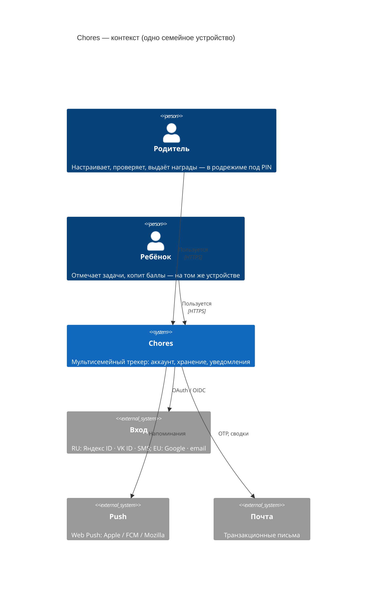
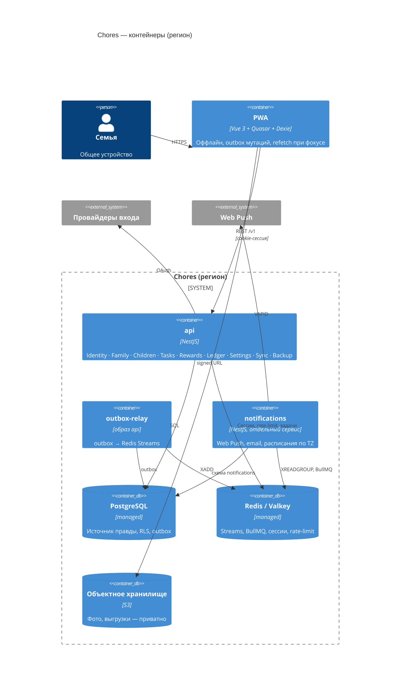

# 02 — Бэкенд: нагрузка, модульный монолит, события, вход, синк

Ресерч перед ADR. По каждому пункту: контекст и ограничения → варианты → решение → риски. Факты,
которые проверялись, помечены ссылкой в разделе «Источники»; оценки и мнения помечены как оценки.

**Статус:** ресерч, версия 2 (сентябрь 2026). Решения здесь — предложения для ADR, не финал.

## 1. Зачем бэкенд (драйверы)

1. **Не потерять данные.** Вся история семьи живёт в IndexedDB одного устройства. Её теряют при
   потере, смене или сбросе устройства, удалении иконки или данных сайта, вытеснении при нехватке
   места. Серверная копия и восстановление по входу в аккаунт закрывают эти случаи. Ограничение
   ITP «7 дней без визитов» к установленной PWA не относится — у неё свой счётчик [webkit-10218].
2. **Аккаунты и мультисемейность.** Сейчас приложение — «одна семья на устройство». Чтобы им
   пользовались другие семьи, нужны аккаунт, изоляция данных семей и восстановление по входу.
3. **Уведомления.** «Сделай дела», «неделя закрывается» — нужен сервер с расписанием по часовому
   поясу семьи.
4. **Обучение и задел на рост.** Проект — ещё и полигон: событийная архитектура, очереди,
   региональные развёртывания. Часть компонентов закладываем раньше, чем их требует нагрузка
   (см. раздел 5) — это осознанное решение, а не оценка нагрузки.

## 2. Оценка нагрузки

- Семья делает единицы записей в день: отметки задач, редкие покупки наград.
- Амбициозно **10 000 семей**, 10 записей в день на семью → ~100 000 записей/день ≈
  **1–2 записи/с в пике**. Чтения — единицы в секунду (открытие приложения, refetch при фокусе).
- Данные крошечные: годовой леджер семьи — сотни-тысячи строк. Фото — отдельно, см. `04`.
- Всплески — по часовым поясам: крон «напомнить в 18:00 по времени семьи» бьёт волнами.

**Вывод:** один небольшой инстанс API и одна managed-БД держат это с запасом в сотни раз.
Горизонтальное масштабирование по нагрузке не нужно. Всё, что сверх этого, — задел и обучение.

## 3. Форма развёртывания: модульный монолит + выделенные сервисы

**Почему комбинированная схема.** Под нашу задачу и размер приложения отдельные сервисы и
контейнеры под каждую сущность (дети, задачи, награды, леджер) не нужны. Эти домены маленькие,
тесно связаны (отметка задачи → баллы → серия → приз) и меняются вместе — разнесённые по сервисам,
они дали бы распределённые транзакции, сетевые границы и N деплоев без выгоды. Поэтому доменное
ядро — один модульный монолит. А то, что действительно отделяется — другой характер нагрузки,
собственный жизненный цикл, общение только через события, — **выделяем в отдельный сервис сразу**.
Первый такой сервис — Notifications.

**Варианты:**

| Вариант | Плюсы | Минусы |
|---|---|---|
| Микросервисы по доменам | Независимый деплой каждого домена | Домены связаны, транзакции распределённые, N деплоев — накладные расходы без выгоды на нашем масштабе |
| Один монолит на всё | Проще всего | Рассылки и расписания делят процесс с API; границу Notifications потом выделять дороже |
| **Модульный монолит + выделенные сервисы** | Ядро без распределённых транзакций; то, что живёт своей жизнью, изолировано с первого дня | Нужна дисциплина границ модулей в ядре (как FSD на фронте) и контракт событий |

**Решение:**

| Сервис | Что внутри | Когда |
|---|---|---|
| **`api`** — модульный монолит | Все доменные модули (таблица ниже), HTTP API, запись событий в `outbox`, `outbox-relay` отдельной командой из того же образа | С первого дня |
| **`notifications`** — отдельный сервис | Подписки Web Push, расписания напоминаний по часовому поясу семьи, шаблоны, отправка push и email | **С первого дня** |
| `analytics` — отдельный сервис | Приём событий, агрегаты, ClickHouse | По триггеру: дашборды или рост объёма событий. До этого события лежат в `outbox` |

**Почему Notifications — отдельно с первого дня:**

- Другой характер нагрузки: волны по часовым поясам («сделай дела в 18:00 по времени семьи»),
  ретраи внешних push-сервисов — не должны тормозить API.
- Не участвует в доменных транзакциях: всё, что ему нужно, приходит событиями (`task.completed`,
  `week.closing`, `family.timezone.changed`).
- Свой жизненный цикл и внешние зависимости (VAPID, почтовый провайдер, Web Push-эндпоинты).
- Отработка событийной архитектуры с настоящим отдельным потребителем (см. раздел 5).

**Границы `notifications`:** свой контейнер и свой образ; своя схема в той же Postgres
(`notifications.*`: подписки, расписания, журнал отправок) — таблицы ядра не читает; с ядром
общается только событиями — consumer group в Redis Streams и очереди BullMQ. Код — в том же монорепозитории,
общий пакет `contracts` со схемами событий.

**Когда выделять следующий сервис** — только по такому же явному признаку: свой характер нагрузки,
общение только событиями, независимое масштабирование. Размер модуля или «так чище» — не признак.

### Модули монолита

| Модуль | Что внутри |
|---|---|
| **Identity** | Пользователи, внешние аккаунты (Яндекс, VK, Google), OTP, сессии, устройства |
| **Family** | Семья как арендатор, часовой пояс, членство. Роль пока одна — родитель |
| **Children** | Дети, фото (ссылка на хранилище, см. `04`), цели |
| **Tasks** | Каталог задач, периоды активности, правило бонуса |
| **Rewards** | Награды, видимость, варианты (см. бэклог «Награда с выбором») |
| **Ledger** | `completions` (+), `spends` (−) со снимками цены, баланс и серии — вычисляются |
| **Settings** | Бонус, вехи серии, прочие правила семьи |
| **Sync** | Приём мутаций, идемпотентность, курсоры (раздел 7) |
| **Backup** | Экспорт/импорт — тот же JSON-контракт, что сейчас в `features/backup` |

Модули общаются через публичный интерфейс модуля (как `index.ts` слайса на фронте) и через события.
Прямой доступ к таблицам чужого модуля запрещён.

## 4. Процессы и события: как всё связано

```
клиент ──REST──▶ api ──(одна транзакция)──▶ Postgres: данные + outbox
                                               │
                                        outbox-relay
                                               ▼
                                   Redis Streams (events)
                                    │                 │
                        group: notifications   group: analytics (позже)
                                    ▼
                          notifications ──▶ Web Push / email
```

## 5. Брокер и очереди: Redis с первого дня

**Честная оценка нагрузки:** на старте Redis **не обязателен**. Postgres закрывает всё сам:
очереди через `SKIP LOCKED` (pg-boss, Graphile Worker), события через transactional outbox и
LISTEN/NOTIFY, сессии в таблице, rate-limit в памяти процесса [pgboss-cmp]. Нам нужно на 2–3
порядка меньше, чем эти инструменты держат.

**Решение: всё равно закладываем Redis с первого дня** — ради масштабирования и чтобы отработать
событийную архитектуру с потребителями на реальном проекте. Kafka — перебор: отдельный кластер,
ZooKeeper/KRaft, операционная сложность без выгоды на нашем объёме.

**Как используем:**

| Задача | Механизм |
|---|---|
| Доменные события | **Redis Streams** + consumer groups: у каждого потребителя своя группа, свой темп, `XACK`, переобработка зависших через `XAUTOCLAIM`, dead-letter поток после N попыток |
| Отложенные и повторяющиеся задачи | **BullMQ**: напоминания по часовому поясу семьи, ретраи отправки push |
| Сессии | Ключ `session:{id}` с TTL, индекс сессий пользователя — для «выйти на всех устройствах» |
| Rate-limit | `@nestjs/throttler` с Redis-хранилищем — работает при нескольких инстансах API |

**Надёжность событий — transactional outbox.** Запись в Redis нельзя сделать атомарной с записью в
Postgres: событие может потеряться (упали после коммита) или появиться без данных (упали до).
Поэтому:

1. `api` в той же транзакции, что и бизнес-запись, пишет событие в таблицу `outbox`.
2. `outbox-relay` читает неотправленные строки, делает `XADD` в Stream, помечает отправленными.
3. Доставка — «хотя бы один раз»: при сбое между `XADD` и пометкой событие уйдёт повторно.
   Потребители идемпотентны — хранят обработанные `eventId`.

Outbox заодно — журнал событий для Analytics до появления ClickHouse.

**Какой Redis: Redis или Valkey — по тому, что даёт облако региона.** Оба подходят:

- **Лицензия нам не мешает.** С Redis 7.4 (март 2024) лицензия RSALv2/SSPLv1, Redis 8 (май 2025)
  добавил AGPLv3 [redis-agpl]. RSAL/SSPL запрещают продавать сам Redis как managed-сервис, AGPL
  требует открыть исходники, если модифицировал Redis и отдаёшь его по сети. Мы подключаемся к нему
  как клиент — ни то, ни другое нас не касается.
- **Возможности для нас одинаковые.** Streams, consumer groups, TTL, Lua и BullMQ работают в обоих.
  Фичи только Redis 8 (JSON, поиск, vector sets) нам не нужны.
- **Решает managed-предложение.** Valkey — форк 7.2.4 под BSD-3 в Linux Foundation. Managed Valkey:
  Yandex Cloud, OVHcloud, Aiven; managed Redis: VK Cloud, Selectel, Scaleway, Upstash, Redis Cloud
  [yc-valkey, ovh-valkey, vk-dbaas]. Выбор по региону — в `03`. Есть выбор — берём Redis.

Дальше в документе «Redis» означает Redis-совместимое хранилище, код пишем под общую базу.

**Переход Redis ↔ Valkey** — дешёвый, если держать три правила:

1. **Только общая база команд Redis 7.2.** Valkey — форк 7.2.4, протокол RESP тот же, клиенты
   (`ioredis`, `node-redis`) и BullMQ работают с обоими. Дальше ветки расходятся: у Redis 8 в ядре
   JSON, поиск, vector sets; у Valkey 8/9 — свои расширения. Streams, TTL, Lua-скрипты BullMQ —
   в общей базе. Не используем модули и команды, которые есть только в одной ветке.
2. **В Redis нет ничего невосстановимого.** Источник правды — Postgres: события лежат в `outbox`,
   напоминания пересоздаются из расписаний семьи, сессии в худшем случае — повторный вход.
3. **Переезд — это смена адреса подключения, а не миграция данных.** Дамп RDB между ветками
   переносить не пытаемся: форматы после 7.2 разошлись (не проверено по версиям). Порядок:
   остановить `notifications` и `outbox-relay`, дочитать потоки, переключить URL, пересоздать отложенные задачи из
   Postgres, запустить.

При таких правилах переезд — час работы и короткое окно обслуживания.

**Риски:** ещё один stateful-компонент на каждый регион (мониторинг, память, персистентность AOF
для Streams). Запасной вариант, если Redis станет обузой: pg-boss поверх Postgres — outbox уже есть,
меняется только транспорт.

## 6. Вход и сессии

### 6.1. Закон РФ меняет картину для RU-контура

Google и Apple в RU-контуре исключены **законом**, а не технической доступностью.

- **Ч. 10 ст. 8 149-ФЗ** (введена 406-ФЗ, действует с 01.12.2023): владелец сайта — гражданин РФ
  или российское юрлицо — авторизует пользователей, находящихся в РФ, только через: номер
  российского оператора связи, ЕСИА (Госуслуги), ЕБС (биометрия) или иную информационную систему
  российского владельца (Яндекс ID, VK ID, Сбер ID, T-ID) [cons-406].
- **Ст. 13.55 КоАП** (199-ФЗ от 26.06.2026, действует с **07.07.2026**): гражданин — 10–20 тыс. ₽,
  должностное лицо — 30–50 тыс. ₽, юрлицо — 500–700 тыс. ₽ [cons-199, garant-199]. В июне–июле
  2026 российские сервисы массово убрали вход через Google и Apple [ria-2026].
- Закон привязан к **владельцу сайта и местонахождению пользователя**, а не к региону сервера.
  Если владелец EU-контура — гражданин РФ, вход через Google на EU-контуре для пользователя из РФ
  тоже формально нарушение. Нужно определить владельца каждого контура (открытый вопрос №1).
- На горизонте — проект «Антифрод 3.0»: иностранным сайтам оставят только вход по телефону
  [cnews-antifrod]. Пока проект, следим.
- Собственный вход по email-коду для RU — толкование «иной ИС российского владельца», официальных
  разъяснений нет. Безопасный вариант — Яндекс ID / VK ID / телефон.

### 6.2. Провайдеры

| Провайдер | Протокол | Особенности | Контур |
|---|---|---|---|
| **Яндекс ID** | OAuth 2.0, **не OIDC**: нет discovery и `id_token` | PKCE (S256) есть; профиль — `login.yandex.ru/info` | RU |
| **VK ID** | OAuth 2.1, PKCE обязателен | `device_id` из колбэка при обмене кода, userinfo только POST — generic-клиенты не подходят | RU |
| **Телефон (SMS/звонок)** | Свой OTP | Прямо назван в законе; платно за каждое SMS | RU, опционально |
| **Google** | OIDC, Authorization Code + PKCE | Стандартный | EU |
| **Email OTP** | Свой, 6 цифр | Работает внутри PWA (см. 6.4) | EU; для RU — под вопросом |
| **Passkeys** | WebAuthn | iOS 16+; для повторного входа, не для восстановления | Оба, позже |
| Сбер ID | OIDC | Нужна организация, оферта через ЭДО, сертификат — тяжело без юрлица | Не берём |
| Apple | OIDC-подобный | Для PWA не обязателен (правило 4.8 — для нативных); в RU запрещён; редирект из standalone-PWA глючит | Не берём на старте |

Вывод: Яндекс и VK — не «OIDC-провайдеры», под каждый нужен свой адаптер.

### 6.3. Своё или готовое

Managed-SaaS (Auth0, Clerk, Supabase Auth) не подходит: ни один не развёрнут в обоих регионах.
Self-hosted IdP (Keycloak, Zitadel, Authentik, Ory, Logto) ставится в каждый контур отдельно —
его сравниваем наравне с библиотеками.

| Вариант | Плюсы | Минусы |
|---|---|---|
| Self-hosted IdP в каждом контуре | Готовые сессии, MFA, админка | Ещё один stateful-сервис × 2 региона; Keycloak тяжёлый, Zitadel с v3 под AGPL; Яндекс/VK всё равно донастраивать |
| **Better Auth** в монолите | Сессии в своей БД, провайдер `vk` из коробки, generic OAuth под Яндекс, passkeys, email OTP | Интеграция с NestJS — комьюнити-пакет, нужен `bodyParser: false` |
| Свой тонкий слой (passport / openid-client / arctic) | Полный контроль, без магии | Сессии, OTP, ротация, защита от перебора — всё своими руками |

Lucia устарела (март 2025), Auth.js с сентября 2025 сопровождает команда Better Auth [lucia,
authjs-ba].

**Решение (предварительно):** библиотека внутри монолита, не отдельный IdP. Первый кандидат —
Better Auth; до ADR — спайк: VK + Яндекс + email OTP + сессии в Redis в связке с NestJS. Не
получилось чисто — свой тонкий слой: клиенты OAuth на `openid-client` (Google) и свои адаптеры
(Яндекс, VK), сессии и OTP — в модуле Identity.

### 6.4. Сессии

**Решение:** серверная сессия + cookie `httpOnly; Secure; SameSite=Lax`. API на том же сайте, что
и фронт (`app.<домен>` + `api.<домен>` или `/api`). JWT в localStorage не используем.

- httpOnly-cookie не читается скриптом — XSS не уносит сессию.
- Cookie, выставленные сервером, не попадают под 7-дневный лимит ITP (он для cookie из JS); у PWA
  на экране «Домой» свой счётчик [webkit-10218]. Кросс-сайтовые cookie Safari блокирует — отсюда
  требование «тот же сайт».
- Серверную сессию можно отозвать (выход, потеря устройства) без чёрного списка токенов.
- CSRF: `SameSite=Lax` + проверка `Origin` на изменяющих запросах.

**Подвох iOS:** у PWA на экране «Домой» и у Safari **раздельные cookie**. OAuth-редирект может
открыться в Safari, и сессия окажется не в PWA [netguru-pwa]. Поэтому: вход по OTP-коду вводится
прямо в PWA; для OAuth — редирект в том же окне (не попап) и проверка на реальном iPad до ADR.
Magic link не берём — ссылка из почты открывается в Safari.

### 6.5. Родрежим и PIN

Родрежим на общем устройстве остаётся: аккаунт родителя залогинен на семейном планшете, PIN
отделяет «родительские» экраны от ребёнка. Сервер доверяет сессии, PIN — локальный замок.

- Сейчас PIN хранится в `settings` открытым текстом — перед синком хранить хеш (PBKDF2/argon2 с
  солью), иначе он уедет на сервер и в бэкапы.
- Шесть цифр — 10⁶ вариантов: нужен лимит попыток с нарастающей задержкой.
- Сброс PIN — через повторный вход в аккаунт.

## 7. Offline-first и синхронизация

**Принцип сохраняем:** PWA работает оффлайн, источник правды — сервер, клиент — кеш с очередью.

### 7.1. Варианты

| Вариант | Итог |
|---|---|
| **Своя очередь (outbox в Dexie) + REST** | **Берём.** Данных мало, модель простая, остаётся Dexie и наш NestJS |
| Dexie Cloud | Меньше всего правок клиента, но свой сервер: SaaS или self-host от €3 495 [dexie-cloud] |
| RxDB | Хороший протокол репликации, но переезд с Dexie; часть плагинов платная |
| PowerSync | Зрелый оффлайн, но SQLite вместо Dexie, отдельный сервис, лицензия FSL. Запасной вариант для будущего мульти-девайса |
| ElectricSQL 1.x | Синхронизирует только чтение — запись и очередь всё равно свои |
| Zero (Rocicorp) | Нет оффлайн-записи — не подходит |
| CRDT (Automerge, Yjs) | Для совместного редактирования текста — не наш случай |

### 7.2. Этапы

Пока устройство в семье одно, конфликтов нет — нужен не «синк», а «не потерять и восстановить».

1. **v1 — отправка и восстановление.** Вход в аккаунт → первичная выгрузка локальной базы
   (JSON-контракт `features/backup`). Дальше каждая локальная запись кладёт мутацию в outbox и
   отправляется на сервер. На новом устройстве — полное восстановление с сервера.
2. **v2 — двусторонний инкрементальный синк** — когда появятся несколько устройств (см. «Планы на
   будущее»). Pull по курсору при открытии и фокусе.

**Протокол закладываем сразу под v2**, тогда переход — добавление pull-эндпоинта, без миграции:

- У каждой мутации `mutationId` (uuid) — ключ идемпотентности; сервер хранит обработанные.
- Сервер присваивает строке монотонную `version` (bigserial). Pull — «всё, где `version > N`».
  Часам клиента не доверяем: на детском планшете они могут уходить. `updatedAt` клиента — только
  для отображения.
- Удаление — только tombstone: `archivedAt` для каталога (уже есть), `deletedAt` для строк
  леджера (откат покупки, снятие отметки).
- Конфликты: для леджера — объединение множеств; для каталога и настроек — LWW по серверной
  `version`, при несовпадении `baseVersion` сервер решает сам или отвечает 409.
- `UNIQUE (family_id, child_id, task_id, date)` на `completions`. Два оффлайн-устройства создадут
  разные uuid на одну ячейку → детерминированный id (uuidv5 от ребёнок+задача+дата) или
  `ON CONFLICT` с возвратом «победителя» клиенту.
- `date` — день в часовом поясе семьи (`families.timezone`), не UTC.
- **Производное не синхронизируем:** баланс, серии, бейджи вычисляются из леджера (как и сейчас).
  Состояние поздравлений (`streaks.celebrated`) — локальное состояние устройства.
- Сервер может отклонить мутацию (например, покупку при нехватке баланса после оффлайна) —
  статус `rejected` в outbox и понятный UI.
- Realtime (SSE/WebSocket) не делаем: refetch при открытии и фокусе.

### 7.3. Переезд с текущей версии

IndexedDB и установленная PWA привязаны к origin (`siritoskon.github.io`). Переезд на свой домен
и на бэкенд даёт новый origin с пустой базой — у тех, кто уже установил приложение, данные на новом
адресе не появятся.

**Для нас это не проблема:** сейчас приложением пользуется одна семья, все данные — локально на
одном устройстве. Переносим их вручную: экспорт JSON на старом адресе → вход на новом → импорт
(тот же контракт `features/backup`, он же первичная выгрузка на сервер в v1). Отдельный механизм
миграции между origin (страница-мост, `postMessage`) не делаем. Старый адрес после переезда —
страница «Приложение переехало» со ссылкой.

## 8. Мультитенантность и данные

### 8.1. Изоляция семей

- **Первый рубеж:** колонка `family_id` во всех таблицах семьи, скоуп в репозиториях. `family_id`
  берётся только из сессии, никогда из тела запроса.
- **Второй рубеж — Row-Level Security Postgres:** политика
  `family_id = current_setting('app.family_id')::uuid`, в начале транзакции
  `set_config('app.family_id', $1, true)` (флаг `true` — на транзакцию, совместимо с PgBouncer в
  transaction mode). Роль приложения — не владелец таблиц и без `BYPASSRLS`, иначе нужен
  `FORCE ROW LEVEL SECURITY`.
- Ошибка в коде скоупа тогда не превращается в утечку чужой семьи — для данных о детях это важно.

### 8.2. ORM

| ORM | RLS | Схемы/типы |
|---|---|---|
| **Drizzle** | Нативные `pgPolicy`/`enableRLS`, политики в миграциях drizzle-kit [drizzle-rls] | `drizzle-zod` — zod-схемы из таблиц |
| Kysely | Через транзакцию + `set_config`, политики в raw-миграциях | Типы из схемы |
| Prisma | Через client extension (транзакция на запрос), политики руками в SQL [prisma-rls] | Свой DSL |
| TypeORM / MikroORM | Тот же приём, без поддержки | Декораторы |

**Решение (предварительно):** Drizzle — близко к SQL, RLS живёт в схеме и миграциях, стыкуется
с zod.

### 8.3. Таблицы (регион, серверные)

Повторяют текущие таблицы Dexie (`completions`, `spends`, `children`, `tasks`, `rewards`,
`settings`, `streaks`, `versionLog`), плюс аккаунты и служебное.

| Таблица | Назначение |
|---|---|
| `users` | Пользователь региона. Единственная не скоупится по семье |
| `auth_accounts` | Внешние аккаунты: провайдер + внешний id → `userId` |
| `families` | Семья: название, `timezone`, регион |
| `memberships` | `userId` × `familyId` × `role` (пока только `parent`) |
| `devices` | Устройства семьи: для сессий и push-подписок |
| `children`, `tasks`, `rewards`, `reward_variants`, `settings` | Каталог семьи, `archivedAt` вместо удаления |
| `completions` | Отметки: `points` — снимок; уникальность ребёнок × задача × день |
| `spends` | Покупки и призы: `cost` — снимок, `source: purchase \| streak`, выбор варианта |
| `push_subscriptions` | Web Push endpoint + ключи, по устройству |
| `outbox` | События для Streams и журнал для Analytics |
| `processed_mutations` | `mutationId` принятых мутаций (идемпотентность синка) |

У каждой строки семьи: `family_id`, `version`, `createdAt`, `updatedAt`, `deletedAt`/`archivedAt`.
`streaks` на сервер не едет — вычисляется. Фото — в объектном хранилище, в строке только ключ
(см. `04`).

**Инварианты из MVP сохраняются:** `completions.points` и `spends.cost` — цена на момент события;
правка каталога историю не двигает. Выдача приза за серию — строка `spends` с `source: 'streak'`,
отдельной таблицы нет.

## 9. Контракт API

Клиент уже выводит типы из zod-схем (`z.infer`), валидация — на границах. Логично сделать zod
единым источником правды и для API.

| Вариант | Итог |
|---|---|
| **REST + zod-схемы в общем пакете + OpenAPI** | **Берём.** `nestjs-zod`: валидация, типы и OpenAPI 3.1 из одних схем [nestjs-zod] |
| ts-rest | Общий контракт клиент/сервер, но поддержка Zod 4 пока в RC [ts-rest] |
| tRPC | Не REST: хуже для публичного API, кеширования, других клиентов |

- Общий пакет `contracts` (монорепо): zod-схемы запросов и ответов. Фронт импортирует их напрямую
  в `entities/*/api` — правка там точечная, как и планировалось.
- OpenAPI генерируется из схем — для документации и возможных других клиентов.
- Схемы чтения на фронте остаются снисходительными к старым записям (правило из `CLAUDE.md`).
- Версионирование API: `/v1`, ломающие изменения — только новой версией; старые PWA живут на
  устройствах неделями.

## 10. Стек

| Слой | Выбор | Почему / альтернативы |
|---|---|---|
| Язык | TypeScript strict | Как на фронте |
| Фреймворк | **NestJS** (адаптер Fastify) | Модули, DI, guards, throttler, OpenAPI — структура модульного монолита из коробки. Альтернатива — Hono + `@hono/zod-openapi`: легче, но границы модулей держать дисциплиной. Для обучения и структуры — Nest |
| БД | PostgreSQL (managed) | Источник правды, RLS, PITR |
| ORM | Drizzle | Раздел 8.2 |
| Брокер, очереди, сессии | Redis или Valkey (managed, по региону) | Раздел 5 |
| Файлы | S3-совместимое хранилище в регионе | Приватное, signed URLs — `04` |
| Auth | Better Auth или свой слой | Раздел 6.3, спайк |
| Push | Web Push + VAPID (`web-push`) | Раздел 11 |
| Контейнеры | Два образа: `api` (+ команда `outbox-relay`) и `notifications` | Раздел 3; оркестрация не нужна — `03` |

## 11. Уведомления

- **Web Push на iOS** — с iOS 16.4, только для PWA на экране «Домой», разрешение — по жесту
  пользователя. APNs/FCM напрямую не нужны: стандартный Web Push с VAPID, транспорт выбирает
  браузер (Apple push service, FCM у Chrome и Яндекс Браузера).
- **РФ:** RuStore Push — только для нативных Android-приложений. Web Push в Chrome/Яндекс Браузере
  идёт через FCM, а при мобильных ограничениях («белые списки») FCM бывает недоступен
  [novaya-push] — не проверено технически.
- **Вывод:** push — «по возможности», не единственный канал. Обязательно: лента уведомлений внутри
  приложения. Email — второй канал для важного (конец недели, сводка).
- Расписания — BullMQ, по часовому поясу семьи; отправка — сервис `notifications`.

## 12. Наблюдаемость и бэкапы

- **Логи:** pino (JSON) в stdout, сбор средствами облака (Yandex Cloud Logging / Loki). Без ПДн
  в логах: id вместо имён.
- **Ошибки:** GlitchTip — совместим с Sentry SDK, лёгкий (от 512 МБ), ставится в каждый регион
  [glitchtip]. Self-hosted Sentry — ~16 ГБ RAM и 40+ контейнеров, не берём.
- **Метрики:** OpenTelemetry по желанию; минимум — длина потоков и лаг consumer groups,
  размер outbox, ошибки отправки push.
- **Бэкапы:** managed Postgres с PITR — у Yandex Cloud ежедневный бэкап + WAL, 7 дней по умолчанию,
  срок увеличивается [yc-pg-backup]. Плюс регулярный логический дамп вне провайдера (в том же
  регионе) и **проверка восстановления раз в квартал**. Redis бэкапить не нужно: источник правды —
  Postgres и outbox.

## 13. C4

### Context


```mermaid
C4Context
  title Chores — контекст (одно семейное устройство)
  Person(parent, "Родитель", "Настраивает, проверяет, выдаёт награды — в родрежиме под PIN")
  Person(child, "Ребёнок", "Отмечает задачи, копит баллы — на том же устройстве")
  System(app, "Chores", "Мультисемейный трекер: аккаунт, хранение, уведомления")
  System_Ext(idp, "Вход", "RU: Яндекс ID · VK ID · SMS; EU: Google · email")
  System_Ext(push, "Push", "Web Push: Apple / FCM / Mozilla")
  System_Ext(mail, "Почта", "Транзакционные письма")
  Rel(parent, app, "Пользуется", "HTTPS")
  Rel(child, app, "Пользуется", "HTTPS")
  Rel_D(app, idp, "OAuth / OIDC")
  Rel_D(app, push, "Напоминания")
  Rel_D(app, mail, "OTP, сводки")
  UpdateLayoutConfig($c4ShapeInRow="3", $c4BoundaryInRow="1")
```

### Container (один регион)


```mermaid
C4Container
  title Chores — контейнеры (регион)
  Person(family, "Семья", "Общее устройство")
  Container(spa, "PWA", "Vue 3 + Quasar + Dexie", "Оффлайн, outbox мутаций, refetch при фокусе")
  System_Boundary(sys, "Chores (регион)") {
    Container(api, "api", "NestJS", "Identity · Family · Children · Tasks · Rewards · Ledger · Settings · Sync · Backup")
    Container(relay, "outbox-relay", "образ api", "outbox → Redis Streams")
    Container(notify, "notifications", "NestJS, отдельный сервис", "Web Push, email, расписания по TZ")
    ContainerDb(db, "PostgreSQL", "managed", "Источник правды, RLS, outbox")
    ContainerDb(valkey, "Redis / Valkey", "managed", "Streams, BullMQ, сессии, rate-limit")
    ContainerDb(s3, "Объектное хранилище", "S3", "Фото, выгрузки — приватно")
  }
  System_Ext(idp, "Провайдеры входа")
  System_Ext(push, "Web Push")
  Rel(family, spa, "HTTPS")
  Rel(spa, api, "REST /v1", "cookie-сессия")
  Rel(spa, s3, "signed URL")
  Rel(api, db, "SQL")
  Rel(api, valkey, "Сессии, rate-limit, задачи")
  Rel(api, idp, "OAuth")
  Rel(relay, db, "outbox")
  Rel(relay, valkey, "XADD")
  Rel(notify, valkey, "XREADGROUP, BullMQ")
  Rel(notify, db, "схема notifications")
  Rel(notify, push, "VAPID")
  UpdateLayoutConfig($c4ShapeInRow="3", $c4BoundaryInRow="1")
```

## 14. Риски

| Риск | Что делаем |
|---|---|
| Регуляторика РФ по входу ужесточается («Антифрод 3.0») | Провайдеры входа — адаптеры в модуле Identity; добавить SMS-вход без переделки |
| Владелец EU-контура — резидент РФ | Решить до запуска (вопрос №1) |
| OAuth-редирект уходит в Safari, сессия не в PWA | OTP внутри PWA; проверка на реальном iPad до ADR |
| Push в РФ не доходит | Лента в приложении + email |
| Redis избыточен и стоит денег × 2 региона | Минимальный тариф; запасной путь — pg-boss, outbox уже есть |
| Ошибка скоупа → утечка чужой семьи | RLS вторым рубежом, тесты изоляции |
| Старые PWA на устройствах шлют старый формат | Версия API, снисходительные схемы, протокол синка с `mutationId` |

## 15. Открытые вопросы

1. Кто владелец каждого контура (физлицо, ИП, юрлицо, страна)? От этого зависят вход в EU для
   пользователей из РФ и оператор ПДн (`04`).
2. Email-код в RU-контуре: считаем законным или только Яндекс / VK / телефон?
3. SMS-вход: берём сразу (стоимость за SMS) или только Яндекс и VK?
4. Better Auth + NestJS: результат спайка.
5. Нужна ли лента уведомлений в первой версии, или push + email?

## 16. Планы на будущее

Не реализуемо на текущем этапе, архитектура оставляет место:

- **Разные устройства и интерфейсы для родителя и ребёнка** — телефон родителя, планшет ребёнка.
  Нужен синк v2 (раздел 7.2), роли в `memberships`, возможно разделение клиентов (бэклог,
  «Разделение клиентов»).
- **Вход ребёнка** — без своего аккаунта у провайдера: привязка устройства родителем (QR/код),
  ограниченная роль `child`.
- **Несколько опекунов** — второй родитель, бабушка: инвайты, роли `parent` / `guardian`.
- **Realtime** — SSE или WebSocket через Nest gateway, когда refetch при фокусе станет мало.
- **Analytics + ClickHouse** — отдельная consumer group на Streams.
- **Passkeys** для повторного входа.
- **PowerSync** или аналог — если собственный синк не вытянет мульти-девайс.

## Источники

- [webkit-10218] https://webkit.org/blog/10218/full-third-party-cookie-blocking-and-more/
- [pgboss-cmp] https://www.pkgpulse.com/guides/bullmq-vs-bee-queue-vs-pg-boss-job-queues-nodejs-2026
- [redis-agpl] https://redis.io/blog/agplv3/
- [yc-valkey] https://yandex.cloud/en/docs/managed-valkey/
- [ovh-valkey] https://www.ovhcloud.com/en/public-cloud/valkey/
- [vk-dbaas] https://cloud.vk.ru/docs/dbs/dbaas
- [cons-406] https://www.consultant.ru/law/hotdocs/81325.html
- [cons-199] https://www.consultant.ru/document/cons_doc_LAW_537878/
- [garant-199] https://www.garant.ru/article/2136195/
- [ria-2026] https://ria.ru/20260629/servisy-2101807695.html
- [cnews-antifrod] https://www.cnews.ru/news/top/2026-07-30_zhestkie_pravila_dlya_google_i
- Яндекс ID: https://yandex.com/dev/id/doc/en/codes/code-url
- VK ID: https://github.com/VKCOM/vkid-web-sdk
- Better Auth + NestJS: https://better-auth.com/docs/integrations/nestjs
- [lucia] https://github.com/lucia-auth/lucia
- [authjs-ba] https://better-auth.com/blog/authjs-joins-better-auth
- [netguru-pwa] https://www.netguru.com/blog/how-to-share-session-cookie-or-state-between-pwa-in-standalone-mode-and-safari-on-ios
- [dexie-cloud] https://dexie.org/cloud/pricing
- ElectricSQL 1.0: https://electric-sql.com/blog/2025/03/17/electricsql-1.0-released
- Zero offline: https://zero.rocicorp.dev/docs/offline
- [drizzle-rls] https://orm.drizzle.team/docs/rls
- [prisma-rls] https://github.com/prisma/prisma-client-extensions/tree/main/row-level-security
- [nestjs-zod] https://github.com/BenLorantfy/nestjs-zod
- [ts-rest] https://ts-rest.com/changelog
- [novaya-push] https://novayagazeta.eu/articles/2026/03/28/push-ne-proidet
- RuStore Push: https://www.rustore.ru/help/en/sdk/push-notifications
- [glitchtip] https://glitchtip.com/documentation/install/
- [yc-pg-backup] https://yandex.cloud/en/docs/managed-postgresql/concepts/backup

**Не проверено:** хранилище при запуске PWA из Safari против иконки на iOS 18+; Vue SDK у
PowerSync; поведение VK ID (`id_token`, discovery); T-ID; работа passkeys в standalone-PWA;
правила `FORCE`/`BYPASSRLS` — по документации Postgres, без проверки на managed-инстансе;
доступность Sentry SaaS из РФ.
