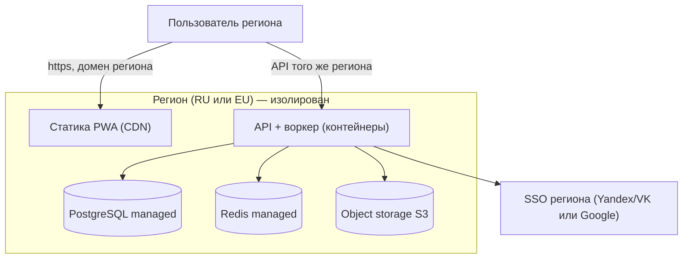

# 03 — Хостинг и регионы (RU + EU)

Как разместить онлайн и как разнести на два **изолированных сегмента** RU и EU.

## Зачем два сегмента
- **RU (152-ФЗ):** персональные данные граждан РФ должны храниться (первично) на серверах в РФ.
- **EU (GDPR):** данные жителей EU — в EU, с правами субъекта данных.
- Данные детей чувствительны → изоляция не для галочки.

**Принцип: два полностью независимых развёртывания.** Свои БД, домены, ключи, бэкапы, auth-провайдеры.
Никакой кросс-региональной репликации. **Пользователь/семья принадлежит одному региону** (выбор при регистрации/по домену).
Фронт (SPA) регионо-независим — он просто указывает на API своего региона.

## Что вообще надо разместить
1. **Фронт (статика PWA)** — уже собран Vite'ом, отдаётся как статика/CDN.
2. **API + воркер** (см. `02`) — контейнер(ы).
3. **PostgreSQL** — managed.
4. **Redis** — managed/serverless.
5. **Объектное хранилище** (аватарки/выгрузки) — S3-совместимое, в регионе. Про фото детей и приватную раздачу (signed URLs, не публичный CDN) — см. [`04-personal-data-and-photos.md`](./04-personal-data-and-photos.md).
6. **Домены + TLS + DNS.**
7. **CI/CD** — сборка и деплой по регионам (раздельные секреты).

## Варианты хостинга по сегментам

### EU-сегмент
Много удобных вариантов «managed-контейнеры без k8s»:
- **Fly.io** (регион `fra`/`ams`), **Render**, **Railway**, **Scaleway** (FR), **Hetzner** (DE, дёшево — VM/Docker),
  **Cloud Run** (GCP `europe-*`), **AWS eu-central**.
- **БД:** Neon / Supabase (EU-регион) / провайдерский managed PG. **Redis:** Upstash (EU). **Файлы:** Cloudflare R2 / Scaleway / S3 eu.
- **Фронт:** Cloudflare Pages / Netlify / тот же GitHub Pages (глобальный CDN; фронт не содержит ПДн — только код).
- **Auth:** Google OIDC (+ email magic-link). Managed-auth (Clerk/Auth0/Supabase) — ок.

### RU-сегмент
- **Облака РФ:** Yandex Cloud, VK Cloud, Selectel, Timeweb Cloud.
  Контейнеры: Yandex Serverless Containers / Managed Kubernetes / просто VM с Docker (для нашего масштаба — VM или serverless-контейнер).
- **БД:** Managed PostgreSQL (Yandex/VK/Selectel). **Redis:** Managed Redis там же. **Файлы:** Object Storage (Yandex/VK, S3-совместимо).
- **Домен:** `.ru` через RU-регистратора (reg.ru и т.п.).
- **Auth (важно):** Google может быть недоступен/нестабилен в РФ → основной вход **Yandex ID / VK ID**, Google опционально.
- **Нюанс CDN/DNS:** Cloudflare в РФ временами нестабилен; для RU лучше DNS/edge от РФ-провайдера или напрямую с инстанса.

## Домены
- Купить два: например `choresup.ru` (RU) и `choresup.eu` / `choresup.app` (EU). Имя — на выбор.
- Раздельные DNS-зоны, раздельные TLS (Let's Encrypt / провайдерский).
- Разводка регионов: **по домену** (`.ru` → RU-стек, `.eu` → EU-стек) — просто и прозрачно для локализации данных.
  Опционально — гео-редирект с общего лендинга, но хранение всегда в домене-регионе.

## Топология (один регион, повторяется дважды)

Два таких блока (RU и EU) **не связаны** между собой: отдельные БД, бакеты, ключи, бэкапы (бэкапы остаются в регионе).

## CI/CD
- Собираем образ один раз, деплоим в оба региона раздельными пайплайнами с разными секретами (URL БД, ключи auth, бакеты).
- Фронт: сборка с региональным `API_BASE` (build-time env) → две сборки статики, каждая на свой домен.
  Текущий GitHub Actions деплой на Pages расширяем/дублируем под регионы.
- Секреты РФ-облака держать в РФ-контуре, EU — в EU; не смешивать.

## Ориентир по стоимости (очень грубо, в месяц)
Масштаб семейного приложения — копеечный:
- **EU:** VM Hetzner ~€4–15 **или** Fly/Render free-low tier; managed PG small ~€0–20 (Neon free старт); Redis Upstash free; R2 копейки. Итог: **~€5–30**.
- **RU:** аналогично у Yandex/VK/Selectel/Timeweb — **~500–2000 ₽**.
- Домены: `.ru` ~200–1000 ₽/год, `.eu`/`.app` ~€5–15/год.
Основные расходы появятся только при реальном масштабе (тысячи активных семей) — но и там это десятки, не сотни €.

## Порядок внедрения
1. Поднять **один регион** (EU проще стартовать) целиком: API + PG + Redis + auth + деплой фронта с `API_BASE`.
2. Прогнать миграцию с локального PWA (импорт JSON → серверная модель), включить синк.
3. Клонировать конфигурацию во **второй регион** (RU) с РФ-провайдерами и Yandex/VK ID.
4. Развести по доменам; проверить, что данные не покидают регион (бэкапы, хранилище, логи — в регионе).

## Открытые вопросы
- Managed-auth vs своё OIDC (и совместимость провайдера с обоими регионами).
- Нужен ли вообще RU-сегмент на старте, или сначала EU, а RU — по мере необходимости.
- Нативная обёртка (Capacitor) для нормальных push на iOS — влияет на выбор push-канала.
